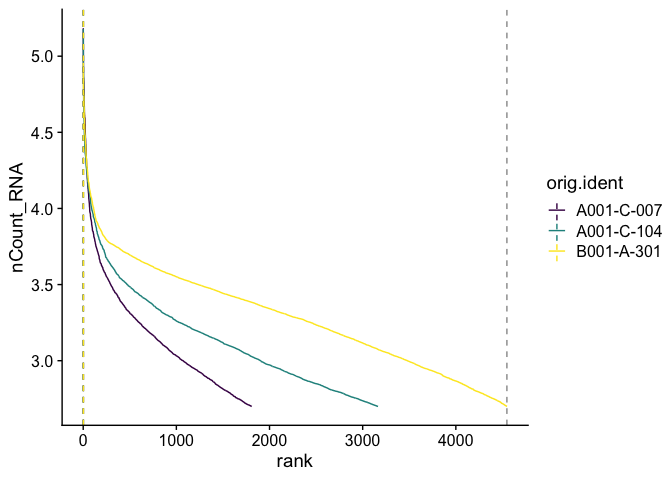
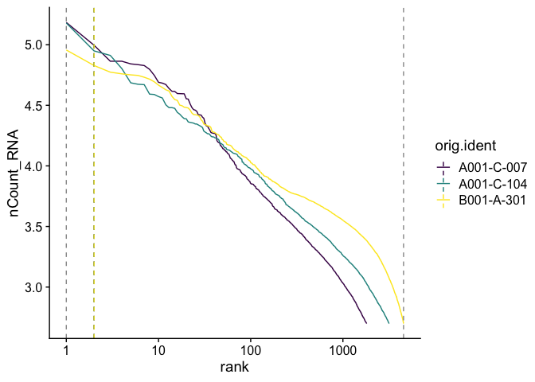

# Introduction to Single Cell RNA-Seq Part 1: Create Seurat object


Our first Markdown document concentrates on getting data into R and setting up our initial object. We will also replicate some of the tables and figures found in the Cellranger web summary.

## Load packages
We will start each section by loading the libraries necessary for that portion of the analysis.

``` r
library(Seurat)     # single cell RNA-Seq analysis
library(kableExtra) # format tables
library(ggplot2)   # create graphics
library(viridis)   # accessible color palettes
```

## Experiment metadata
The metadata we have available for this subset of the [Becker experiment](https://www.nature.com/articles/s41588-022-01088-x) during this workshop is very basic; we don't have a record of patient identifiers, biopsy dates, treatment course, or prognosis. Instead, for each sample, we know the group (healthy, polyp, or cancerous tissue) and the sequencing run, which we can derive from the read header.
Let's create a data table containing this information.

``` r
experiment.metadata <- data.frame(id = c("A001-C-007",
                                         "A001-C-104",
                                         "B001-A-301"),
                                  group = c("Colorectal Cancer",
                                            "Polyp",
                                            "Normal"),
                                  run = c("A00509:126:HTLFWDMXX:1",
                                          "A00509:116:HTLNJDMXX:1",
                                          "A00509:113:HTNCWDMXX:1"))
experiment.metadata %>%
  kable() %>%
  kable_styling("striped")
```

<table class="table table-striped" style="margin-left: auto; margin-right: auto;">
 <thead>
  <tr>
   <th style="text-align:left;"> id </th>
   <th style="text-align:left;"> group </th>
   <th style="text-align:left;"> run </th>
  </tr>
 </thead>
<tbody>
  <tr>
   <td style="text-align:left;"> A001-C-007 </td>
   <td style="text-align:left;"> Colorectal Cancer </td>
   <td style="text-align:left;"> A00509:126:HTLFWDMXX:1 </td>
  </tr>
  <tr>
   <td style="text-align:left;"> A001-C-104 </td>
   <td style="text-align:left;"> Polyp </td>
   <td style="text-align:left;"> A00509:116:HTLNJDMXX:1 </td>
  </tr>
  <tr>
   <td style="text-align:left;"> B001-A-301 </td>
   <td style="text-align:left;"> Normal </td>
   <td style="text-align:left;"> A00509:113:HTNCWDMXX:1 </td>
  </tr>
</tbody>
</table>

## Create metrics tables
The **expression_data_cellranger.zip** file that we have downloaded in previous step contains the single cell matrix files and HDF5 files for three single nuclei RNASeq samples from [Becker et al., 2022](https://www.nature.com/articles/s41588-022-01088-x). After un-compressing the file, please make sure that you see three folders (A001-C-007, A001-C-104, and B001-A-301) in the same folder as this R markdown file. If the three folders are located elsewhere, please change the assignment of "dataset.loc" in the code box below to reflect the location of your data.

``` r
experiment.name <- "Becker 2022 colorectal cancer continuum"
dataset.loc <- "./"
```

In this section, the metrics_summary.csv files produced by Cellranger are used to create a single table summarizing the sequencing metrics for each sample.

``` r
sample.metrics <- lapply(experiment.metadata$id, function(id){
  metrics = read.csv(file.path(dataset.loc,
                               paste0(id,"/outs"),
                               "metrics_summary.csv"),
                     colClasses = "character")
})
experiment.metrics <- do.call("rbind", sample.metrics)
rownames(experiment.metrics) <- experiment.metadata$id

sequencing.metrics <- data.frame(t(experiment.metrics[,c(1:19)]))

rownames(sequencing.metrics) <- gsub("\\."," ", rownames(sequencing.metrics))

sequencing.metrics %>%
  kable(caption = 'Cell Ranger Results') %>%
  pack_rows("Overview", 1, 3, label_row_css = "background-color: #666; color: #fff;") %>%
  pack_rows("Sequencing Characteristics", 4, 9, label_row_css = "background-color: #666; color: #fff;") %>%
  pack_rows("Mapping Characteristics", 10, 19, label_row_css = "background-color: #666; color: #fff;") %>%
  kable_styling("striped")
```

<table class="table table-striped" style="margin-left: auto; margin-right: auto;">
<caption>Cell Ranger Results</caption>
 <thead>
  <tr>
   <th style="text-align:left;">  </th>
   <th style="text-align:left;"> A001.C.007 </th>
   <th style="text-align:left;"> A001.C.104 </th>
   <th style="text-align:left;"> B001.A.301 </th>
  </tr>
 </thead>
<tbody>
  <tr grouplength="3"><td colspan="4" style="background-color: #666; color: #fff;"><strong>Overview</strong></td></tr>
<tr>
   <td style="text-align:left;padding-left: 2em;" indentlevel="1"> Estimated Number of Cells </td>
   <td style="text-align:left;"> 1,808 </td>
   <td style="text-align:left;"> 3,164 </td>
   <td style="text-align:left;"> 4,548 </td>
  </tr>
  <tr>
   <td style="text-align:left;padding-left: 2em;" indentlevel="1"> Mean Reads per Cell </td>
   <td style="text-align:left;"> 77,010 </td>
   <td style="text-align:left;"> 150,265 </td>
   <td style="text-align:left;"> 38,644 </td>
  </tr>
  <tr>
   <td style="text-align:left;padding-left: 2em;" indentlevel="1"> Median Genes per Cell </td>
   <td style="text-align:left;"> 937 </td>
   <td style="text-align:left;"> 970 </td>
   <td style="text-align:left;"> 1,336 </td>
  </tr>
  <tr grouplength="6"><td colspan="4" style="background-color: #666; color: #fff;"><strong>Sequencing Characteristics</strong></td></tr>
<tr>
   <td style="text-align:left;padding-left: 2em;" indentlevel="1"> Number of Reads </td>
   <td style="text-align:left;"> 139,233,487 </td>
   <td style="text-align:left;"> 475,437,350 </td>
   <td style="text-align:left;"> 175,752,014 </td>
  </tr>
  <tr>
   <td style="text-align:left;padding-left: 2em;" indentlevel="1"> Valid Barcodes </td>
   <td style="text-align:left;"> 97.4% </td>
   <td style="text-align:left;"> 95.4% </td>
   <td style="text-align:left;"> 98.5% </td>
  </tr>
  <tr>
   <td style="text-align:left;padding-left: 2em;" indentlevel="1"> Sequencing Saturation </td>
   <td style="text-align:left;"> 75.5% </td>
   <td style="text-align:left;"> 84.4% </td>
   <td style="text-align:left;"> 69.0% </td>
  </tr>
  <tr>
   <td style="text-align:left;padding-left: 2em;" indentlevel="1"> Q30 Bases in Barcode </td>
   <td style="text-align:left;"> 97.4% </td>
   <td style="text-align:left;"> 96.4% </td>
   <td style="text-align:left;"> 96.6% </td>
  </tr>
  <tr>
   <td style="text-align:left;padding-left: 2em;" indentlevel="1"> Q30 Bases in RNA Read </td>
   <td style="text-align:left;"> 95.6% </td>
   <td style="text-align:left;"> 94.4% </td>
   <td style="text-align:left;"> 94.1% </td>
  </tr>
  <tr>
   <td style="text-align:left;padding-left: 2em;" indentlevel="1"> Q30 Bases in UMI </td>
   <td style="text-align:left;"> 97.5% </td>
   <td style="text-align:left;"> 96.4% </td>
   <td style="text-align:left;"> 96.5% </td>
  </tr>
  <tr grouplength="10"><td colspan="4" style="background-color: #666; color: #fff;"><strong>Mapping Characteristics</strong></td></tr>
<tr>
   <td style="text-align:left;padding-left: 2em;" indentlevel="1"> Reads Mapped to Genome </td>
   <td style="text-align:left;"> 94.3% </td>
   <td style="text-align:left;"> 92.1% </td>
   <td style="text-align:left;"> 89.0% </td>
  </tr>
  <tr>
   <td style="text-align:left;padding-left: 2em;" indentlevel="1"> Reads Mapped Confidently to Genome </td>
   <td style="text-align:left;"> 72.2% </td>
   <td style="text-align:left;"> 49.2% </td>
   <td style="text-align:left;"> 83.8% </td>
  </tr>
  <tr>
   <td style="text-align:left;padding-left: 2em;" indentlevel="1"> Reads Mapped Confidently to Intergenic Regions </td>
   <td style="text-align:left;"> 7.7% </td>
   <td style="text-align:left;"> 7.0% </td>
   <td style="text-align:left;"> 4.3% </td>
  </tr>
  <tr>
   <td style="text-align:left;padding-left: 2em;" indentlevel="1"> Reads Mapped Confidently to Intronic Regions </td>
   <td style="text-align:left;"> 26.9% </td>
   <td style="text-align:left;"> 20.5% </td>
   <td style="text-align:left;"> 40.1% </td>
  </tr>
  <tr>
   <td style="text-align:left;padding-left: 2em;" indentlevel="1"> Reads Mapped Confidently to Exonic Regions </td>
   <td style="text-align:left;"> 37.7% </td>
   <td style="text-align:left;"> 21.6% </td>
   <td style="text-align:left;"> 39.4% </td>
  </tr>
  <tr>
   <td style="text-align:left;padding-left: 2em;" indentlevel="1"> Reads Mapped Confidently to Transcriptome </td>
   <td style="text-align:left;"> 61.6% </td>
   <td style="text-align:left;"> 39.8% </td>
   <td style="text-align:left;"> 74.0% </td>
  </tr>
  <tr>
   <td style="text-align:left;padding-left: 2em;" indentlevel="1"> Reads Mapped Antisense to Gene </td>
   <td style="text-align:left;"> 2.4% </td>
   <td style="text-align:left;"> 1.9% </td>
   <td style="text-align:left;"> 4.8% </td>
  </tr>
  <tr>
   <td style="text-align:left;padding-left: 2em;" indentlevel="1"> Fraction Reads in Cells </td>
   <td style="text-align:left;"> 29.8% </td>
   <td style="text-align:left;"> 37.8% </td>
   <td style="text-align:left;"> 36.9% </td>
  </tr>
  <tr>
   <td style="text-align:left;padding-left: 2em;" indentlevel="1"> Total Genes Detected </td>
   <td style="text-align:left;"> 24,930 </td>
   <td style="text-align:left;"> 26,393 </td>
   <td style="text-align:left;"> 26,515 </td>
  </tr>
  <tr>
   <td style="text-align:left;padding-left: 2em;" indentlevel="1"> Median UMI Counts per Cell </td>
   <td style="text-align:left;"> 1,206 </td>
   <td style="text-align:left;"> 1,246 </td>
   <td style="text-align:left;"> 1,922 </td>
  </tr>
</tbody>
</table>

This roughly replicates the table that appears in the Cellranger web summary file.

## Create Seurat object
We will be using [Seurat](http://satijalab.org/seurat/) as the basis of our single cell (or nucleus) RNA-Seq analysis. Seurat is a popular R package that is designed for QC, analysis, and exploration of single cell data, which aims to enable users to identify and interpret sources of heterogeneity from single cell transcriptomic measurements, and to integrate diverse types of single cell data.
In addition to the standard Seurat workflow, this documentation makes use of some custom code, and brings in functions from other packages. For additional information on Seurat standard workflows, see the authors' [tutorials](https://satijalab.org/seurat/vignettes.html).

#### Read in expression matrix
First, we read in data from each individual sample folder.

``` r
expression.data <- lapply(experiment.metadata$id, function(id){
  sample.matrix = Read10X_h5(file.path(dataset.loc, id, "/outs","filtered_feature_bc_matrix.h5"))
  colnames(sample.matrix) = paste(sapply(strsplit(colnames(sample.matrix),split="-"), '[[', 1L), id, sep="_")
  sample.matrix
})
names(expression.data) <- experiment.metadata$id
```


``` r
View(expression.data)
```

#### Merge matrices

``` r
aggregate.data <- do.call("cbind", expression.data)
```

#### Create object
The `CreateSeuratObject` function allows feature (gene) and cell filtering by minimum cell and feature counts. We will set these to 0 for now in order to explore manual filtering more fully in part 2.

``` r
experiment.aggregate <- CreateSeuratObject(
  aggregate.data,
  project = experiment.name,
  min.cells = 0,
  min.features = 0,
  names.field = 2, # tells Seurat which part of the cell identifier contains the sample name
  names.delim = "\\_")
```

## Add metadata
We can now attach the metadata in our table to the Seurat object.

#### Match metadata to expression matrix
The columns of the expression matrix correspond to the cells in the experiment. When we created the Seurat object, the "names.field" and "names.delim" arguments allowed Seurat to infer sample identity from the cell names. This information is stored in a variable called "orig.ident."

``` r
levels(experiment.aggregate$orig.ident)
```

```
## [1] "A001-C-007" "A001-C-104" "B001-A-301"
```

These sample identifiers are stored in the experiment.metadata object as well, which allows us to match the other metadata contained within that table to the correct cells within the Seurat object.

``` r
sample.index <- match(experiment.aggregate$orig.ident, experiment.metadata$id)
```

#### Attach metadata
The AddMetaData function returns a new Seurat object with an additional column in the metadata table containing the new information.

``` r
experiment.aggregate <- AddMetaData(experiment.aggregate,
                                    metadata = experiment.metadata$group[sample.index],
            col.name = "group")
experiment.aggregate$group <- factor(experiment.aggregate$group,
                                     levels = c("Normal", "Polyp", "Colorectal Cancer"))
experiment.aggregate <- AddMetaData(experiment.aggregate,
                                    metadata = experiment.metadata$run[sample.index],
                                    col.name = "run")
experiment.aggregate$run <- factor(experiment.aggregate$run,
                                   levels = c("A00509:113:HTNCWDMXX:1",
                                              "A00509:116:HTLNJDMXX:1",
                                              "A00509:126:HTLFWDMXX:1"))
```

## Explore the Seurat object
A Seurat object is a complex data structure containing the data from a single cell or single nucleus assay and **all** of the information associated with the experiment, including annotations, analysis, and more. This data structure was developed by the authors of the Seurat analysis package, for use with their pipeline.

``` r
View(experiment.aggregate)
```

Most Seurat functions take the object as an argument, and return either a new Seurat object or a ggplot object (a visualization). As the analysis continues, more and more data will be added to the object.


``` r
slotNames(experiment.aggregate)
```

```
##  [1] "assays"       "meta.data"    "active.assay" "active.ident" "graphs"      
##  [6] "neighbors"    "reductions"   "images"       "project.name" "misc"        
## [11] "version"      "commands"     "tools"
```

``` r
experiment.aggregate@assays # a slot is accessed with the @ symbol
```

```
## $RNA
## Assay (v5) data with 38606 features for 9520 cells
## First 10 features:
##  DDX11L2, MIR1302-2HG, FAM138A, ENSG00000290826, OR4F5, ENSG00000238009,
## ENSG00000239945, ENSG00000239906, ENSG00000241860, ENSG00000241599 
## Layers:
##  counts
```

- Which slots are empty, and which contain data?
- What type of object is the content of the meta.data slot?
- What metadata is available?

There is often more than one way to interact with the information stored in each of a Seurat objects many slots. The default behaviors of different access functions are described in the help documentation.


``` r
# which slot is being accessed here? find another way to produce the result
head(experiment.aggregate[[]])
```

```
##                             orig.ident nCount_RNA nFeature_RNA
## AAACCCAAGTTATGGA_A001-C-007 A001-C-007       2099         1568
## AAACCCACAACGCCCA_A001-C-007 A001-C-007        865          696
## AAACCCACAGAAGTTA_A001-C-007 A001-C-007        547          472
## AAACCCAGTCAGTCCG_A001-C-007 A001-C-007        621          550
## AAACGAAGTTGGTGTT_A001-C-007 A001-C-007        968          784
## AAACGCTAGGAGCAAA_A001-C-007 A001-C-007        747          641
##                                         group                    run
## AAACCCAAGTTATGGA_A001-C-007 Colorectal Cancer A00509:126:HTLFWDMXX:1
## AAACCCACAACGCCCA_A001-C-007 Colorectal Cancer A00509:126:HTLFWDMXX:1
## AAACCCACAGAAGTTA_A001-C-007 Colorectal Cancer A00509:126:HTLFWDMXX:1
## AAACCCAGTCAGTCCG_A001-C-007 Colorectal Cancer A00509:126:HTLFWDMXX:1
## AAACGAAGTTGGTGTT_A001-C-007 Colorectal Cancer A00509:126:HTLFWDMXX:1
## AAACGCTAGGAGCAAA_A001-C-007 Colorectal Cancer A00509:126:HTLFWDMXX:1
```

The use of syntax is often a matter of personal preference. In the interest of clarity, this documentation will generally use the more explicit syntax, with a few exceptions.

## Barcode inflection plots

Imagine the barcode rank plot from the Cell Ranger web summary. That graphic plots the number of UMIs against the barcode rank, and typically has a sharp inflection point where the number of UMIs drops dramatically. These points can represent a transition between cell types from a higher RNA content population to a lower RNA content population, or from cell-associated barcodes to background.

The Seurat `BarcodeInflectionsPlot` provides a similar graphic. In this case, because we are using the filtered barcode matrix, rather than all barcodes, much of the background is absent from the plot.


``` r
experiment.aggregate <- CalculateBarcodeInflections(experiment.aggregate)
BarcodeInflectionsPlot(experiment.aggregate) +
  scale_color_viridis_d()
```

<!-- -->

Adding a log-scale transformation to the x-axis increases the resemblance to the Cell Ranger plot. Values on the y-axis are already log-transformed.


``` r
BarcodeInflectionsPlot(experiment.aggregate) +
  scale_x_continuous(trans = "log10") +
  scale_color_viridis_d()
```

<!-- -->

## Prepare for the next section

#### Save object

``` r
saveRDS(experiment.aggregate, file="scRNA_workshop-01.rds")
```

#### Download Rmd

``` r
download.file("https://raw.githubusercontent.com/ucdavis-bioinformatics-training/2023-December-Single-Cell-RNA-Seq-Analysis/main/data_analysis/02-filtering.Rmd", "02-filtering.Rmd")
```

#### Session information

``` r
sessionInfo()
```

```
## R version 4.4.0 (2024-04-24)
## Platform: aarch64-apple-darwin20
## Running under: macOS Ventura 13.5.2
## 
## Matrix products: default
## BLAS:   /Library/Frameworks/R.framework/Versions/4.4-arm64/Resources/lib/libRblas.0.dylib 
## LAPACK: /Library/Frameworks/R.framework/Versions/4.4-arm64/Resources/lib/libRlapack.dylib;  LAPACK version 3.12.0
## 
## locale:
## [1] en_US.UTF-8/en_US.UTF-8/en_US.UTF-8/C/en_US.UTF-8/en_US.UTF-8
## 
## time zone: America/Los_Angeles
## tzcode source: internal
## 
## attached base packages:
## [1] stats     graphics  grDevices utils     datasets  methods   base     
## 
## other attached packages:
## [1] viridis_0.6.5      viridisLite_0.4.2  ggplot2_3.5.1      kableExtra_1.4.0  
## [5] Seurat_5.1.0       SeuratObject_5.0.2 sp_2.1-4          
## 
## loaded via a namespace (and not attached):
##   [1] RColorBrewer_1.1-3     rstudioapi_0.16.0      jsonlite_1.8.8        
##   [4] magrittr_2.0.3         spatstat.utils_3.0-4   farver_2.1.2          
##   [7] rmarkdown_2.27         vctrs_0.6.5            ROCR_1.0-11           
##  [10] spatstat.explore_3.2-7 htmltools_0.5.8.1      sass_0.4.9            
##  [13] sctransform_0.4.1      parallelly_1.37.1      KernSmooth_2.23-22    
##  [16] bslib_0.7.0            htmlwidgets_1.6.4      ica_1.0-3             
##  [19] plyr_1.8.9             plotly_4.10.4          zoo_1.8-12            
##  [22] cachem_1.1.0           igraph_2.0.3           mime_0.12             
##  [25] lifecycle_1.0.4        pkgconfig_2.0.3        Matrix_1.7-0          
##  [28] R6_2.5.1               fastmap_1.2.0          fitdistrplus_1.1-11   
##  [31] future_1.33.2          shiny_1.8.1.1          digest_0.6.35         
##  [34] colorspace_2.1-0       patchwork_1.2.0        tensor_1.5            
##  [37] RSpectra_0.16-1        irlba_2.3.5.1          labeling_0.4.3        
##  [40] progressr_0.14.0       fansi_1.0.6            spatstat.sparse_3.0-3 
##  [43] httr_1.4.7             polyclip_1.10-6        abind_1.4-5           
##  [46] compiler_4.4.0         bit64_4.0.5            withr_3.0.0           
##  [49] fastDummies_1.7.3      highr_0.11             MASS_7.3-60.2         
##  [52] tools_4.4.0            lmtest_0.9-40          httpuv_1.6.15         
##  [55] future.apply_1.11.2    goftest_1.2-3          glue_1.7.0            
##  [58] nlme_3.1-164           promises_1.3.0         grid_4.4.0            
##  [61] Rtsne_0.17             cluster_2.1.6          reshape2_1.4.4        
##  [64] generics_0.1.3         hdf5r_1.3.10           gtable_0.3.5          
##  [67] spatstat.data_3.0-4    tidyr_1.3.1            data.table_1.15.4     
##  [70] xml2_1.3.6             utf8_1.2.4             spatstat.geom_3.2-9   
##  [73] RcppAnnoy_0.0.22       ggrepel_0.9.5          RANN_2.6.1            
##  [76] pillar_1.9.0           stringr_1.5.1          spam_2.10-0           
##  [79] RcppHNSW_0.6.0         later_1.3.2            splines_4.4.0         
##  [82] dplyr_1.1.4            lattice_0.22-6         survival_3.5-8        
##  [85] bit_4.0.5              deldir_2.0-4           tidyselect_1.2.1      
##  [88] miniUI_0.1.1.1         pbapply_1.7-2          knitr_1.47            
##  [91] gridExtra_2.3          svglite_2.1.3          scattermore_1.2       
##  [94] xfun_0.44              matrixStats_1.3.0      stringi_1.8.4         
##  [97] lazyeval_0.2.2         yaml_2.3.8             evaluate_0.23         
## [100] codetools_0.2-20       tibble_3.2.1           cli_3.6.2             
## [103] uwot_0.2.2             xtable_1.8-4           reticulate_1.37.0     
## [106] systemfonts_1.1.0      munsell_0.5.1          jquerylib_0.1.4       
## [109] Rcpp_1.0.12            globals_0.16.3         spatstat.random_3.2-3 
## [112] png_0.1-8              parallel_4.4.0         dotCall64_1.1-1       
## [115] listenv_0.9.1          scales_1.3.0           ggridges_0.5.6        
## [118] leiden_0.4.3.1         purrr_1.0.2            rlang_1.1.3           
## [121] cowplot_1.1.3
```
