# Introduction to Single Cell RNA-Seq Part 2: QA and filtering


## Set up workspace
First, we need to load the required libraries.

``` r
library(Seurat)
library(ggplot2)
library(tidyr)
library(kableExtra)
```

If you are continuing directly from part 1, the experiment.aggregate object is likely already in your workspace. In case you cleared your workspace at the end of the previous section, or are working on this project at a later date after re-starting R, you can use the `readRDS` function to read your saved Seurat object from part 1.

``` r
experiment.aggregate <- readRDS("scRNA_workshop-01.rds")
experiment.aggregate
```

```
## An object of class Seurat 
## 38606 features across 9520 samples within 1 assay 
## Active assay: RNA (38606 features, 0 variable features)
##  1 layer present: counts
```

The seed is used to initialize pseudo-random functions. Some of the functions we will be using have pseudo-random elements. Setting a common seed ensures that all of us will get the same results, and that the results will remain stable when re-run.

``` r
set.seed(12345)
```

## Mitochondrial gene expression
Filtering on the expression of genes from the mitochondrial genome is not appropriate in all cell types. However, in many tissues, low-quality / dying cells may exhibit extensive mitochondrial contamination. Even when not filtering on mitochondrial expression, the data can be interesting or informative.

The `PercentageFeatureSet` function calculates the proportion of counts originating from a set of features. Genes in the human mitochondrial genome begin with 'MT', while those in the mouse mitochondrial genome begin with 'mt'. These naming conventions make calculating percent mitochondrial very straightforward.

``` r
experiment.aggregate$percent_MT <- PercentageFeatureSet(experiment.aggregate, pattern = "^MT-")
summary(experiment.aggregate$percent_MT)
```

```
##    Min. 1st Qu.  Median    Mean 3rd Qu.    Max. 
##  0.0000  0.2790  0.5581  0.8236  1.0796 14.1631
```

In this workshop, we are using the filtered feature barcode matrix. While this lowers the likelihood of encountering barcodes that are not cell-associated within our expression matrix, it is still good practice to perform quality assurance on the experiment.

## Display metadata by quantile
Using a few nested functions, we can produce prettier, more detailed, versions of the simple exploratory summary statistics we generated for the available metadata in the last section. In the code below, 10% quantile tables are produced for each metadata value, separated by sample identity.

``` r
kable(do.call("cbind", tapply(experiment.aggregate$nFeature_RNA,
                              Idents(experiment.aggregate),
                              quantile, probs = seq(0,1,0.1))),
      caption = "10% Quantiles of Genes/Cell by Sample") %>% kable_styling()
```

<table class="table" style="margin-left: auto; margin-right: auto;">
<caption>10% Quantiles of Genes/Cell by Sample</caption>
 <thead>
  <tr>
   <th style="text-align:left;">  </th>
   <th style="text-align:right;"> A001-C-007 </th>
   <th style="text-align:right;"> A001-C-104 </th>
   <th style="text-align:right;"> B001-A-301 </th>
  </tr>
 </thead>
<tbody>
  <tr>
   <td style="text-align:left;"> 0% </td>
   <td style="text-align:right;"> 398.0 </td>
   <td style="text-align:right;"> 405.0 </td>
   <td style="text-align:right;"> 412.0 </td>
  </tr>
  <tr>
   <td style="text-align:left;"> 10% </td>
   <td style="text-align:right;"> 495.0 </td>
   <td style="text-align:right;"> 507.0 </td>
   <td style="text-align:right;"> 577.0 </td>
  </tr>
  <tr>
   <td style="text-align:left;"> 20% </td>
   <td style="text-align:right;"> 574.4 </td>
   <td style="text-align:right;"> 585.0 </td>
   <td style="text-align:right;"> 732.0 </td>
  </tr>
  <tr>
   <td style="text-align:left;"> 30% </td>
   <td style="text-align:right;"> 680.0 </td>
   <td style="text-align:right;"> 680.9 </td>
   <td style="text-align:right;"> 911.0 </td>
  </tr>
  <tr>
   <td style="text-align:left;"> 40% </td>
   <td style="text-align:right;"> 789.6 </td>
   <td style="text-align:right;"> 799.2 </td>
   <td style="text-align:right;"> 1108.8 </td>
  </tr>
  <tr>
   <td style="text-align:left;"> 50% </td>
   <td style="text-align:right;"> 937.0 </td>
   <td style="text-align:right;"> 969.5 </td>
   <td style="text-align:right;"> 1336.0 </td>
  </tr>
  <tr>
   <td style="text-align:left;"> 60% </td>
   <td style="text-align:right;"> 1133.2 </td>
   <td style="text-align:right;"> 1137.8 </td>
   <td style="text-align:right;"> 1578.0 </td>
  </tr>
  <tr>
   <td style="text-align:left;"> 70% </td>
   <td style="text-align:right;"> 1388.0 </td>
   <td style="text-align:right;"> 1374.0 </td>
   <td style="text-align:right;"> 1827.0 </td>
  </tr>
  <tr>
   <td style="text-align:left;"> 80% </td>
   <td style="text-align:right;"> 1813.6 </td>
   <td style="text-align:right;"> 1742.2 </td>
   <td style="text-align:right;"> 2139.6 </td>
  </tr>
  <tr>
   <td style="text-align:left;"> 90% </td>
   <td style="text-align:right;"> 2614.5 </td>
   <td style="text-align:right;"> 2372.0 </td>
   <td style="text-align:right;"> 2604.0 </td>
  </tr>
  <tr>
   <td style="text-align:left;"> 100% </td>
   <td style="text-align:right;"> 12352.0 </td>
   <td style="text-align:right;"> 12362.0 </td>
   <td style="text-align:right;"> 8966.0 </td>
  </tr>
</tbody>
</table>

``` r
kable(do.call("cbind", tapply(experiment.aggregate$nCount_RNA,
                              Idents(experiment.aggregate),
                              quantile, probs = seq(0,1,0.1))),
      caption = "10% Quantiles of UMI/Cell by Sample") %>% kable_styling()
```

<table class="table" style="margin-left: auto; margin-right: auto;">
<caption>10% Quantiles of UMI/Cell by Sample</caption>
 <thead>
  <tr>
   <th style="text-align:left;">  </th>
   <th style="text-align:right;"> A001-C-007 </th>
   <th style="text-align:right;"> A001-C-104 </th>
   <th style="text-align:right;"> B001-A-301 </th>
  </tr>
 </thead>
<tbody>
  <tr>
   <td style="text-align:left;"> 0% </td>
   <td style="text-align:right;"> 500.0 </td>
   <td style="text-align:right;"> 500.0 </td>
   <td style="text-align:right;"> 500.0 </td>
  </tr>
  <tr>
   <td style="text-align:left;"> 10% </td>
   <td style="text-align:right;"> 580.7 </td>
   <td style="text-align:right;"> 588.0 </td>
   <td style="text-align:right;"> 693.0 </td>
  </tr>
  <tr>
   <td style="text-align:left;"> 20% </td>
   <td style="text-align:right;"> 687.4 </td>
   <td style="text-align:right;"> 696.6 </td>
   <td style="text-align:right;"> 904.4 </td>
  </tr>
  <tr>
   <td style="text-align:left;"> 30% </td>
   <td style="text-align:right;"> 830.1 </td>
   <td style="text-align:right;"> 823.0 </td>
   <td style="text-align:right;"> 1173.0 </td>
  </tr>
  <tr>
   <td style="text-align:left;"> 40% </td>
   <td style="text-align:right;"> 981.8 </td>
   <td style="text-align:right;"> 1003.0 </td>
   <td style="text-align:right;"> 1516.0 </td>
  </tr>
  <tr>
   <td style="text-align:left;"> 50% </td>
   <td style="text-align:right;"> 1206.0 </td>
   <td style="text-align:right;"> 1245.5 </td>
   <td style="text-align:right;"> 1922.5 </td>
  </tr>
  <tr>
   <td style="text-align:left;"> 60% </td>
   <td style="text-align:right;"> 1509.2 </td>
   <td style="text-align:right;"> 1526.8 </td>
   <td style="text-align:right;"> 2407.0 </td>
  </tr>
  <tr>
   <td style="text-align:left;"> 70% </td>
   <td style="text-align:right;"> 1929.8 </td>
   <td style="text-align:right;"> 1930.0 </td>
   <td style="text-align:right;"> 2987.9 </td>
  </tr>
  <tr>
   <td style="text-align:left;"> 80% </td>
   <td style="text-align:right;"> 2707.6 </td>
   <td style="text-align:right;"> 2616.0 </td>
   <td style="text-align:right;"> 3736.2 </td>
  </tr>
  <tr>
   <td style="text-align:left;"> 90% </td>
   <td style="text-align:right;"> 4441.8 </td>
   <td style="text-align:right;"> 4094.2 </td>
   <td style="text-align:right;"> 5124.4 </td>
  </tr>
  <tr>
   <td style="text-align:left;"> 100% </td>
   <td style="text-align:right;"> 152677.0 </td>
   <td style="text-align:right;"> 150946.0 </td>
   <td style="text-align:right;"> 90475.0 </td>
  </tr>
</tbody>
</table>

``` r
kable(round(do.call("cbind", tapply(experiment.aggregate$percent_MT,
                                    Idents(experiment.aggregate),
                                    quantile, probs = seq(0,1,0.1))),
            digits = 3),
      caption = "10% Quantiles of Percent Mitochondrial by Sample") %>% kable_styling()
```

<table class="table" style="margin-left: auto; margin-right: auto;">
<caption>10% Quantiles of Percent Mitochondrial by Sample</caption>
 <thead>
  <tr>
   <th style="text-align:left;">  </th>
   <th style="text-align:right;"> A001-C-007 </th>
   <th style="text-align:right;"> A001-C-104 </th>
   <th style="text-align:right;"> B001-A-301 </th>
  </tr>
 </thead>
<tbody>
  <tr>
   <td style="text-align:left;"> 0% </td>
   <td style="text-align:right;"> 0.000 </td>
   <td style="text-align:right;"> 0.000 </td>
   <td style="text-align:right;"> 0.000 </td>
  </tr>
  <tr>
   <td style="text-align:left;"> 10% </td>
   <td style="text-align:right;"> 0.263 </td>
   <td style="text-align:right;"> 0.346 </td>
   <td style="text-align:right;"> 0.117 </td>
  </tr>
  <tr>
   <td style="text-align:left;"> 20% </td>
   <td style="text-align:right;"> 0.365 </td>
   <td style="text-align:right;"> 0.505 </td>
   <td style="text-align:right;"> 0.163 </td>
  </tr>
  <tr>
   <td style="text-align:left;"> 30% </td>
   <td style="text-align:right;"> 0.469 </td>
   <td style="text-align:right;"> 0.672 </td>
   <td style="text-align:right;"> 0.210 </td>
  </tr>
  <tr>
   <td style="text-align:left;"> 40% </td>
   <td style="text-align:right;"> 0.576 </td>
   <td style="text-align:right;"> 0.843 </td>
   <td style="text-align:right;"> 0.262 </td>
  </tr>
  <tr>
   <td style="text-align:left;"> 50% </td>
   <td style="text-align:right;"> 0.700 </td>
   <td style="text-align:right;"> 1.032 </td>
   <td style="text-align:right;"> 0.322 </td>
  </tr>
  <tr>
   <td style="text-align:left;"> 60% </td>
   <td style="text-align:right;"> 0.855 </td>
   <td style="text-align:right;"> 1.269 </td>
   <td style="text-align:right;"> 0.403 </td>
  </tr>
  <tr>
   <td style="text-align:left;"> 70% </td>
   <td style="text-align:right;"> 1.057 </td>
   <td style="text-align:right;"> 1.530 </td>
   <td style="text-align:right;"> 0.513 </td>
  </tr>
  <tr>
   <td style="text-align:left;"> 80% </td>
   <td style="text-align:right;"> 1.324 </td>
   <td style="text-align:right;"> 1.900 </td>
   <td style="text-align:right;"> 0.683 </td>
  </tr>
  <tr>
   <td style="text-align:left;"> 90% </td>
   <td style="text-align:right;"> 1.713 </td>
   <td style="text-align:right;"> 2.718 </td>
   <td style="text-align:right;"> 0.949 </td>
  </tr>
  <tr>
   <td style="text-align:left;"> 100% </td>
   <td style="text-align:right;"> 14.163 </td>
   <td style="text-align:right;"> 13.357 </td>
   <td style="text-align:right;"> 3.470 </td>
  </tr>
</tbody>
</table>

## Visualize distribution of metadata values
Seurat has a number of convenient built-in functions for visualizing metadata. These functions produce ggplot objects, which can easily be modified using ggplot2. Of course, all of these visualizations can be reproduced with custom code as well, and we will include some examples of both modifying Seurat plots and generating plots from scratch as the analysis continues.

### Violin plots
The `VlnPlot` function produces a composite plot with one panel for each element of the "features" vector. The data are grouped by the provided identity; by default, this is the active identity of the object, which can be accessed using the `Idents()` function, or in the "active.ident" slot.

``` r
VlnPlot(experiment.aggregate,
        features = c("nFeature_RNA", "nCount_RNA","percent_MT"),
        ncol = 1,
        pt.size = 0.3)
```

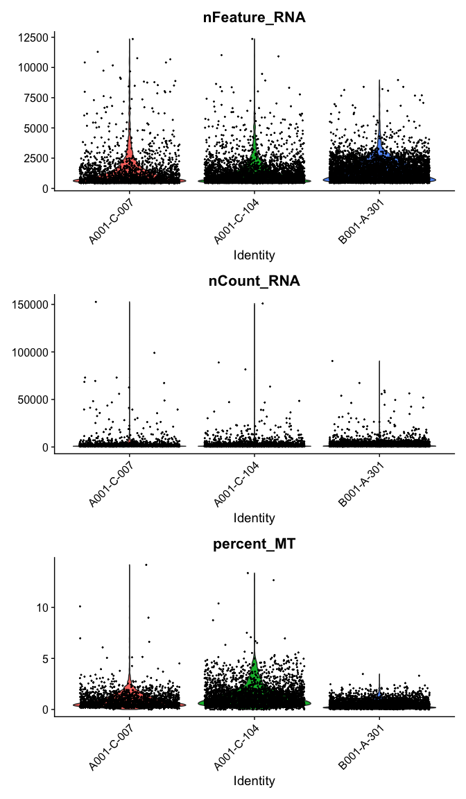<!-- -->

#### Modifying Seurat plots
Modifying the ggplot objects produced by a Seurat plotting function works best on individual panels. Therefore, to recreate the function above with modifications, we can use `lapply` to create a list of plots. In some cases it may be more appropriate to create the plots individually so that different modifications can be applied to each plot.

``` r
lapply(c("nFeature_RNA", "nCount_RNA","percent_MT"), function(feature){
  VlnPlot(experiment.aggregate,
          features = feature,
          pt.size = 0.01) +
    scale_fill_viridis_d(option = "mako") # default colors are not colorblind-friendly
})
```

```
## [[1]]
```

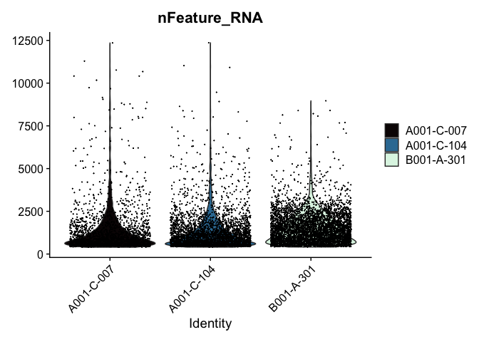<!-- -->

```
## 
## [[2]]
```

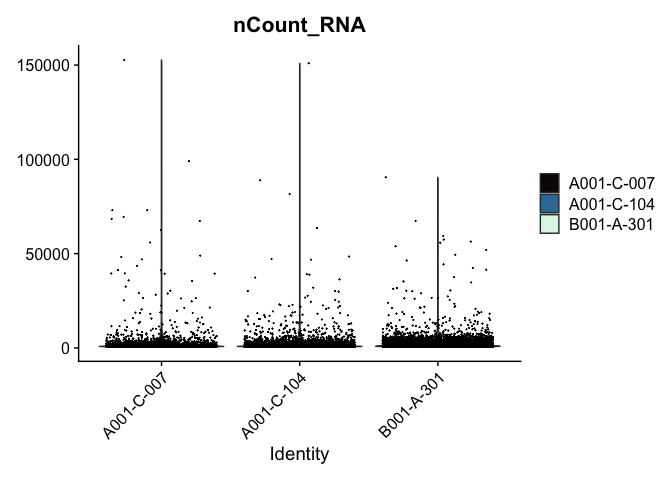<!-- -->

```
## 
## [[3]]
```

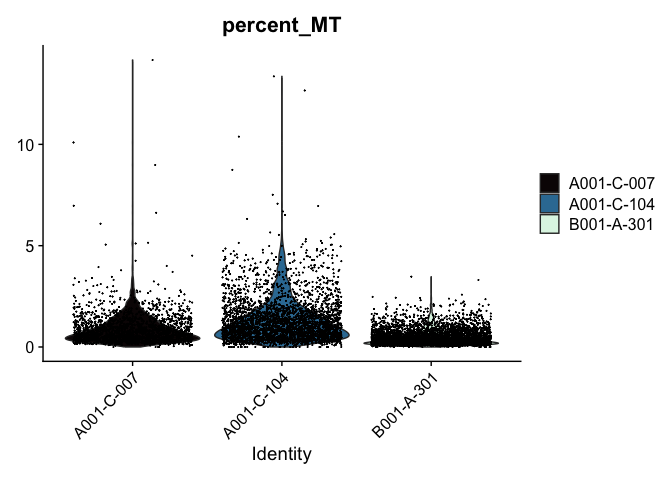<!-- -->

``` r
VlnPlot(experiment.aggregate, features = "nCount_RNA", pt.size = 0.01) + 
  scale_y_continuous(trans = "log10") +
  scale_fill_viridis_d(option = "mako") +
  ggtitle("log10(nCount_RNA)")
```

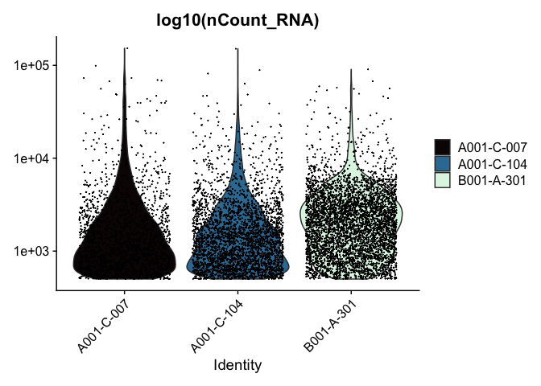<!-- -->

These can later be stitched together with another library, like patchwork, or cowplot.

### Ridge plots
Ridge plots are very similar in appearance to violin plots turned on their sides. In some cases it may be more appropriate to create the plots individually so that appropriate transformations can be applied to each plot.

``` r
RidgePlot(experiment.aggregate, features="nFeature_RNA") +
  scale_fill_viridis_d(option = "mako")
```

<!-- -->

``` r
RidgePlot(experiment.aggregate, features="nCount_RNA") +
  scale_x_continuous(trans = "log10") + # "un-squish" the distribution
  scale_fill_viridis_d(option = "mako")
```

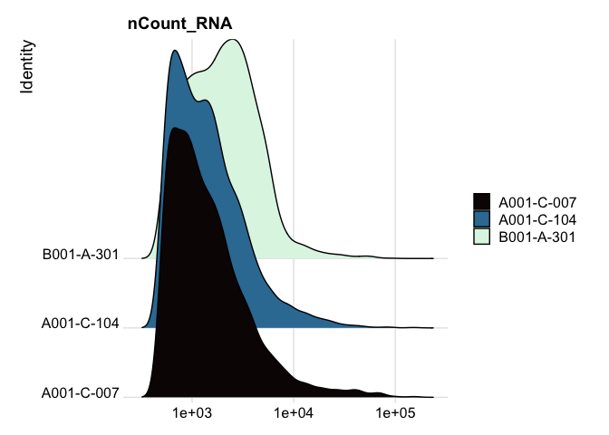<!-- -->

``` r
RidgePlot(experiment.aggregate, features="percent_MT") +
  scale_fill_viridis_d(option = "mako") +
  coord_cartesian(xlim = c(0, 10)) # zoom in on the lower end of the distribution
```

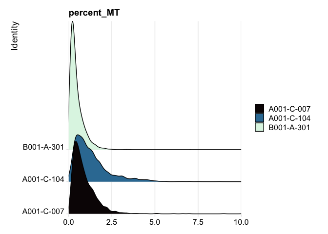<!-- -->

### Custom plots
The Seurat built-in functions are useful and easy to interact with, but sometimes you may wish to visualize something for which a plotting function does not already exist. For example, we might want to see how many cells are expressing each gene over some UMI threshold.

The code below produces a ranked plot similar to the barcode inflection plots from the last section. On the x-axis are the genes arranged from most ubiquitously expressed to rarest. In a single cell dataset, many genes are expessed in a relatively small number of cells, or not at all. The y-axis displays the number of cells in which each gene is expressed.

**Note: This function is SLOW. You may want to skip this code block or run it while you take a break for a few minutes.**

``` r
# retrieve count data
counts <- GetAssayData(experiment.aggregate)
# order genes from most to least ubiquitous
ranked.genes <- names(sort(Matrix::rowSums(counts >= 3), decreasing = TRUE))
# drop genes not expressed in any cell
ranked.genes <- ranked.genes[ranked.genes %in% names(which(Matrix::rowSums(counts >= 3) >= 1))]
# get number of cells in which gene is expressed for each sample
cell.counts <- sapply(ranked.genes, function(gene){
  tapply(counts[gene,], experiment.aggregate$orig.ident, function(x){
    sum(x >= 3)
  })
})
cell.counts <- as.data.frame(t(cell.counts))
cell.counts$gene <- rownames(cell.counts)
cell.counts$rank <- seq(1:dim(cell.counts)[1])
cell.counts %>%
  pivot_longer(cols = 1:3, names_to = "sample", values_to = "count") %>%
  ggplot(mapping = aes(x = rank, y = count, color = sample)) +
  scale_x_continuous(trans = "log10") +
  scale_y_continuous(trans = "log10") +
  geom_point(size=0.2) +
  scale_color_viridis_d(option = "mako") +
  theme_classic() +
  theme(legend.title = element_blank())
```

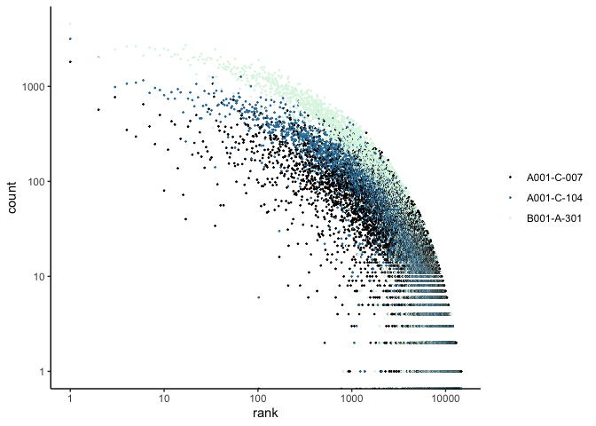<!-- -->

### Scatter plots
Scatter plots allow us to visualize the relationships between the metadata variables.

``` r
# mitochondrial vs UMI
FeatureScatter(experiment.aggregate,
               feature1 = "nCount_RNA",
               feature2 = "percent_MT",
               shuffle = TRUE) +
  scale_color_viridis_d(option = "mako")
```

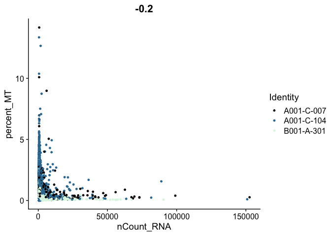<!-- -->

``` r
# mitochondrial vs genes
FeatureScatter(experiment.aggregate,
               feature1 = "nFeature_RNA",
               feature2 = "percent_MT",
               shuffle = TRUE) +
  scale_color_viridis_d(option = "mako")
```

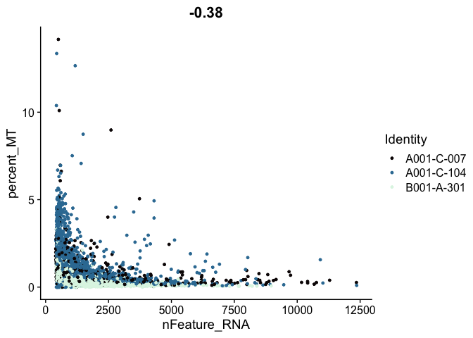<!-- -->

``` r
# genes vs UMI
FeatureScatter(experiment.aggregate,
               feature1 = "nCount_RNA",
               feature2 = "nFeature_RNA",
               shuffle = TRUE)  +
  scale_color_viridis_d(option = "mako")
```

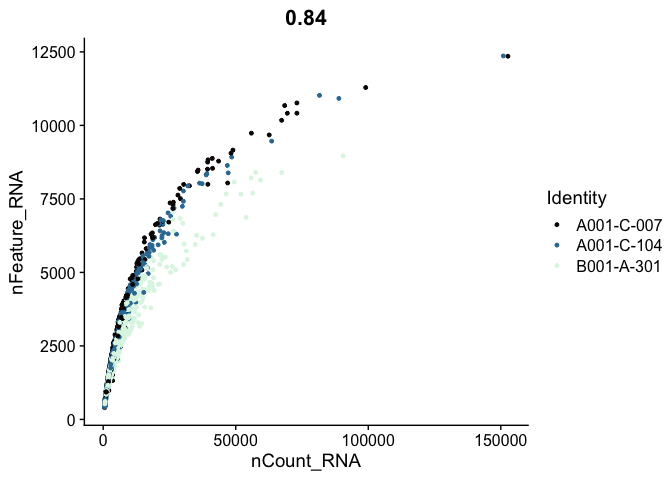<!-- -->

## Cell filtering
The goal of cell filtering is to remove cells with anomolous expression profiles, typically low UMI cells, which may correspond to low-quality cells or background barcodes that made it through the Cell Ranger filtration algorithm. It may also be appropriate to remove outlier cells with extremely high UMI counts.
In this case, the proposed cut-offs on the high end of the distributions are quite conservative, in part to reduce the size of the object and speed up analysis during the workshop.

The plots below display proposed filtering cut-offs.

``` r
FeatureScatter(experiment.aggregate,
               feature1 = "nCount_RNA",
               feature2 = "percent_MT",
               shuffle = TRUE) +
  geom_vline(xintercept = c(1000, 25000)) +
  geom_hline(yintercept = 5) +
  scale_color_viridis_d(option = "mako")
```

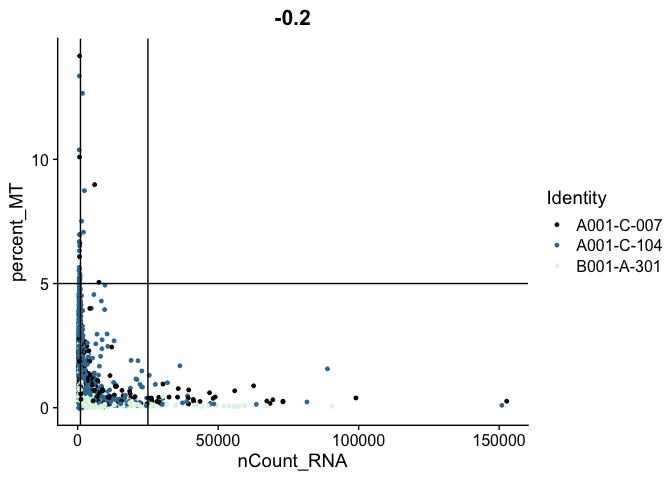<!-- -->

``` r
FeatureScatter(experiment.aggregate,
               feature1 = "nFeature_RNA",
               feature2 = "percent_MT",
               shuffle = TRUE) +
  geom_vline(xintercept = c(500, 7500)) +
  geom_hline(yintercept = 5) +
  scale_color_viridis_d(option = "mako")
```

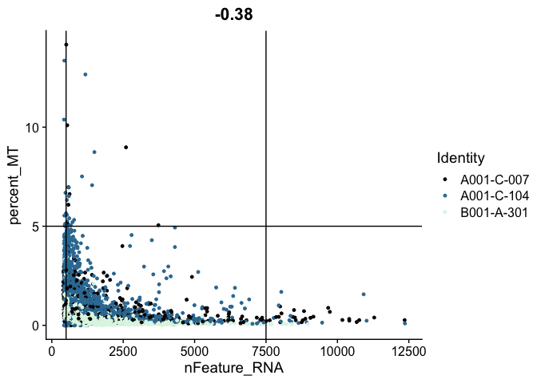<!-- -->

``` r
FeatureScatter(experiment.aggregate,
               feature1 = "nCount_RNA",
               feature2 = "nFeature_RNA",
               pt.size = 0.5,
               shuffle = TRUE)  +
  geom_vline(xintercept = c(1000, 25000)) +
  geom_hline(yintercept = c(500, 7500)) +
  scale_color_viridis_d(option = "mako")
```

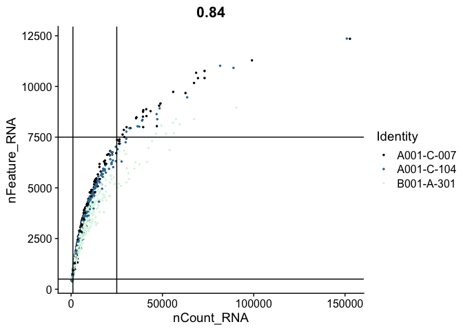<!-- -->

These filters can be put in place with the `subset` function.

``` r
table(experiment.aggregate$orig.ident)
```

```
## 
## A001-C-007 A001-C-104 B001-A-301 
##       1808       3164       4548
```

``` r
# mitochondrial filter
experiment.filter <- subset(experiment.aggregate, percent_MT <= 5)
# UMI filter
experiment.filter <- subset(experiment.filter, nCount_RNA >= 1000 & nCount_RNA <= 25000)
# gene filter
experiment.filter <- subset(experiment.filter, nFeature_RNA >= 500 & nFeature_RNA <= 7500)
# filtering results
experiment.filter
```

```
## An object of class Seurat 
## 38606 features across 6368 samples within 1 assay 
## Active assay: RNA (38606 features, 0 variable features)
##  1 layer present: counts
```

``` r
table(experiment.filter$orig.ident)
```

```
## 
## A001-C-007 A001-C-104 B001-A-301 
##       1038       1880       3450
```

``` r
# ridge plots
RidgePlot(experiment.filter, features="nFeature_RNA") +
  scale_fill_viridis_d(option = "mako")
```

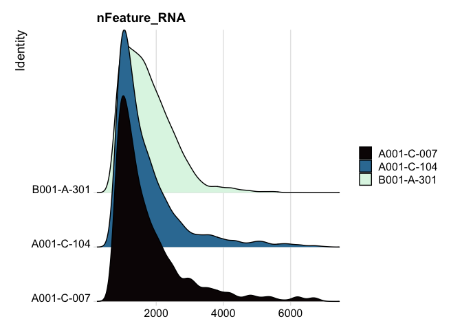<!-- -->

``` r
RidgePlot(experiment.filter, features="nCount_RNA") +
  scale_x_continuous(trans = "log10") + 
  scale_fill_viridis_d(option = "mako")
```

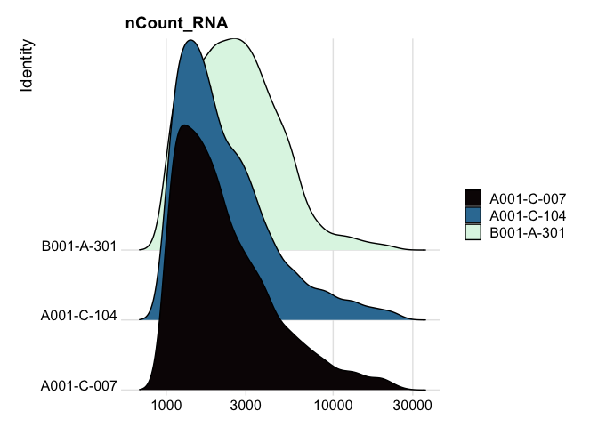<!-- -->

``` r
RidgePlot(experiment.filter, features="percent_MT") +
  scale_fill_viridis_d(option = "mako")
```

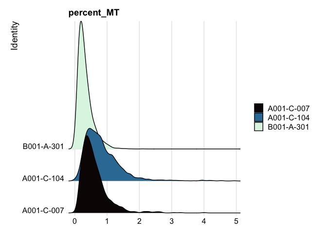<!-- -->

``` r
# use filtered results from now on
experiment.aggregate <- experiment.filter
```

**Play with the filtering parameters, and see how the results change. Is there a set of parameters you feel is more appropriate? Why?**

## Feature filtering
When creating the base Seurat object, we had the opportunity filter out some genes using the "min.cells" argument. At the time, we set that to 0. Since we didn't filter our features then, we can apply a filter at this point. If we had filtered when the object was created, this would be an opportunity to be more aggressive. The custom code below provides a function that filters genes requiring a min.umi in at least min.cells, or takes a user-provided list of genes.

``` r
# define function
FilterGenes <- function(object, min.umi = NA, min.cells = NA, genes = NULL) {
  genes.use = NA
  if (!is.null(genes)) {
    genes.use = intersect(rownames(object), genes)
    } else if (min.cells & min.umi) {
      num.cells = Matrix::rowSums(GetAssayData(object) >= min.umi)
      genes.use = names(num.cells[which(num.cells >= min.cells)])
    }
  object = object[genes.use,]
  object = LogSeuratCommand(object = object)
  return(object)
}
# apply filter
experiment.filter <- FilterGenes(object = experiment.aggregate, min.umi = 2, min.cells = 10)
# filtering results
experiment.filter
```

```
## An object of class Seurat 
## 11475 features across 6368 samples within 1 assay 
## Active assay: RNA (11475 features, 0 variable features)
##  1 layer present: counts
```

``` r
experiment.aggregate <- experiment.filter
```

## Prepare for the next section

#### Save object

``` r
saveRDS(experiment.aggregate, file="scRNA_workshop-02.rds")
```

#### Download Rmd

``` r
download.file("https://raw.githubusercontent.com/ucdavis-bioinformatics-training/2023-December-Single-Cell-RNA-Seq-Analysis/main/data_analysis/03-normalize_scale.Rmd", "03-normalize_scale.Rmd")
```

#### Session Information

``` r
sessionInfo()
```

```
## R version 4.4.0 (2024-04-24)
## Platform: aarch64-apple-darwin20
## Running under: macOS Ventura 13.5.2
## 
## Matrix products: default
## BLAS:   /Library/Frameworks/R.framework/Versions/4.4-arm64/Resources/lib/libRblas.0.dylib 
## LAPACK: /Library/Frameworks/R.framework/Versions/4.4-arm64/Resources/lib/libRlapack.dylib;  LAPACK version 3.12.0
## 
## locale:
## [1] en_US.UTF-8/en_US.UTF-8/en_US.UTF-8/C/en_US.UTF-8/en_US.UTF-8
## 
## time zone: America/Los_Angeles
## tzcode source: internal
## 
## attached base packages:
## [1] stats     graphics  grDevices utils     datasets  methods   base     
## 
## other attached packages:
## [1] kableExtra_1.4.0   tidyr_1.3.1        ggplot2_3.5.1      Seurat_5.1.0      
## [5] SeuratObject_5.0.2 sp_2.1-4          
## 
## loaded via a namespace (and not attached):
##   [1] deldir_2.0-4           pbapply_1.7-2          gridExtra_2.3         
##   [4] rlang_1.1.3            magrittr_2.0.3         RcppAnnoy_0.0.22      
##   [7] spatstat.geom_3.2-9    matrixStats_1.3.0      ggridges_0.5.6        
##  [10] compiler_4.4.0         systemfonts_1.1.0      png_0.1-8             
##  [13] vctrs_0.6.5            reshape2_1.4.4         stringr_1.5.1         
##  [16] pkgconfig_2.0.3        fastmap_1.2.0          labeling_0.4.3        
##  [19] utf8_1.2.4             promises_1.3.0         rmarkdown_2.27        
##  [22] purrr_1.0.2            xfun_0.44              cachem_1.1.0          
##  [25] jsonlite_1.8.8         goftest_1.2-3          highr_0.11            
##  [28] later_1.3.2            spatstat.utils_3.0-4   irlba_2.3.5.1         
##  [31] parallel_4.4.0         cluster_2.1.6          R6_2.5.1              
##  [34] ica_1.0-3              spatstat.data_3.0-4    bslib_0.7.0           
##  [37] stringi_1.8.4          RColorBrewer_1.1-3     reticulate_1.37.0     
##  [40] parallelly_1.37.1      lmtest_0.9-40          jquerylib_0.1.4       
##  [43] scattermore_1.2        Rcpp_1.0.12            knitr_1.47            
##  [46] tensor_1.5             future.apply_1.11.2    zoo_1.8-12            
##  [49] sctransform_0.4.1      httpuv_1.6.15          Matrix_1.7-0          
##  [52] splines_4.4.0          igraph_2.0.3           tidyselect_1.2.1      
##  [55] abind_1.4-5            rstudioapi_0.16.0      yaml_2.3.8            
##  [58] spatstat.random_3.2-3  codetools_0.2-20       miniUI_0.1.1.1        
##  [61] spatstat.explore_3.2-7 listenv_0.9.1          lattice_0.22-6        
##  [64] tibble_3.2.1           plyr_1.8.9             withr_3.0.0           
##  [67] shiny_1.8.1.1          ROCR_1.0-11            evaluate_0.23         
##  [70] Rtsne_0.17             future_1.33.2          fastDummies_1.7.3     
##  [73] survival_3.5-8         polyclip_1.10-6        xml2_1.3.6            
##  [76] fitdistrplus_1.1-11    pillar_1.9.0           KernSmooth_2.23-22    
##  [79] plotly_4.10.4          generics_0.1.3         RcppHNSW_0.6.0        
##  [82] munsell_0.5.1          scales_1.3.0           globals_0.16.3        
##  [85] xtable_1.8-4           glue_1.7.0             lazyeval_0.2.2        
##  [88] tools_4.4.0            data.table_1.15.4      RSpectra_0.16-1       
##  [91] RANN_2.6.1             leiden_0.4.3.1         dotCall64_1.1-1       
##  [94] cowplot_1.1.3          grid_4.4.0             colorspace_2.1-0      
##  [97] nlme_3.1-164           patchwork_1.2.0        cli_3.6.2             
## [100] spatstat.sparse_3.0-3  spam_2.10-0            fansi_1.0.6           
## [103] viridisLite_0.4.2      svglite_2.1.3          dplyr_1.1.4           
## [106] uwot_0.2.2             gtable_0.3.5           sass_0.4.9            
## [109] digest_0.6.35          progressr_0.14.0       ggrepel_0.9.5         
## [112] farver_2.1.2           htmlwidgets_1.6.4      htmltools_0.5.8.1     
## [115] lifecycle_1.0.4        httr_1.4.7             mime_0.12             
## [118] MASS_7.3-60.2
```
