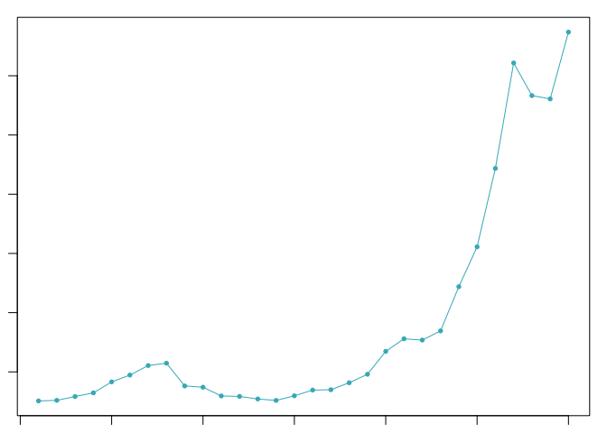
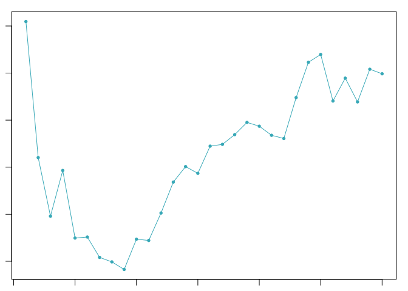
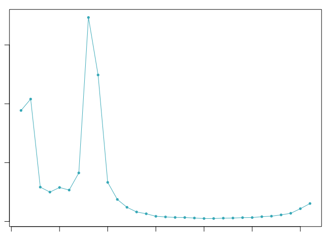
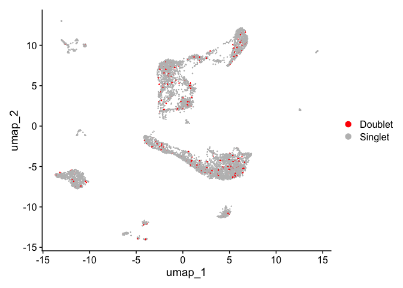

# Introduction to Single Cell RNA-Seq Part 7: Doublet detection
Doublets are cells that appear to be, but are not, real cells. There are two major types of doublets: heterotypic and homotypic. *Heterotypic doublets* are formed by cells with distinct transcriptional profiles. *Homotypic doublets* are formed by cells with similar transcriptional profiles. Heterotypic doublets are relatively easier to detect compared with homotypic doublets.

Depending on the protocols used to barcode single cells/nuclei, doublet rates vary significantly and it can reach as high as 40%. Experimental strategies have been developed to reduce the doublet rate, such as [cell hashing](https://genomebiology.biomedcentral.com/articles/10.1186/s13059-018-1603-1), and [MULTI-Seq](https://www.nature.com/articles/s41592-019-0433-8). However, these techniques require extra steps in sample preparation which leads to extra costs and time, and they do not guarantee to remove all doublets.

Naturally, removing doublets _in silico_ is very appealing and there have been many tools/methods developed to achieve this: [DoubletFinder](https://www.cell.com/cell-systems/pdfExtended/S2405-4712(19)30073-0), DoubletDetection(https://github.com/JonathanShor/DoubletDetection), [DoubletDecon](https://www.sciencedirect.com/science/article/pii/S2211124719312860), [demuxlet](https://www.nature.com/articles/nbt.4042), among others.

<p align = "center">

</p>

<p align = "right" style="font-family:Times;font-size:12px;">
Xi, etc., Cell Systems, 2021, https://www.sciencedirect.com/science/article/pii/S2405471220304592
</p>

## Set up workspace


``` r
library(Seurat)
library(DoubletFinder)
library(ggplot2)
set.seed(12345)
```

## Prepare data for DoubletFinder
[DoubletFinder](https://github.com/chris-mcginnis-ucsf/DoubletFinder) takes fully pre-processed data from Seurat (NormalizeData, FindVariableGenes, ScaleData, RunPCA, and RunUMAP) as input and the process should be done for each sample individually. The input data should be processed to remove low-quality cell clusters first.

``` r
experiment.aggregate <- readRDS("scRNA_workshop-02.rds") # filtered object
experiment.split <- SplitObject(experiment.aggregate, split.by = "orig.ident")
rm(experiment.aggregate)
experiment.split <- lapply(experiment.split, function(sce){
  sce = NormalizeData(sce, normalization.method = "LogNormalize", scale.factor = 10000)
  sce = CellCycleScoring(sce, s.features = cc.genes$s.genes, g2m.features = cc.genes$g2m.genes, set.ident = FALSE)
  sce = FindVariableFeatures(sce)
  sce = ScaleData(sce, vars.to.regress = c("S.Score", "G2M.Score", "percent_MT", "nFeature_RNA"))
  RunPCA(sce, npcs = 100)
})
```

## Parameter selection
In addition to the Seurat object, DoubletFinder takes a number of arguments. These are

* PCs: a vector of statistically significant PCs to use
* pN: the number of artificially generated doublets (default = 0.25)
* pK: PC neighborhood size used to compute network
* nExp: threshold used to make doublet/singlet call

We will use PCs 1-50 (based on the dimensionality reduction section) and the default value of 0.25 for pN.

### pK
The optimal value of pK varies between samples, and is impacted by the number of cell states and magnitude of transcriptional heterogeneity present in the data. The mean-variance normalized bimodality coefficient (BCmvn) is used as a measure of pK optimization. In experiments with known doublet frequencies, BCmvn is maximized by values of pK that produce the most accurate doublet-calling. In the code below, the pK value corresponding to the maxiumum BCmvn is selected for each sample.

``` r
pK <- lapply(experiment.split, function(sce){
  sweep.res = paramSweep(sce, PCs = 1:50, sct = FALSE)
  sweep.stats = summarizeSweep(sweep.res, GT = FALSE)
  BCmvn = find.pK(sweep.stats)
  as.numeric(BCmvn$pK[which(BCmvn$BCmetric == max(BCmvn$BCmetric))])
})
```

<!-- --><!-- --><!-- -->

``` r
pK
```

```
## $`A001-C-007`
## [1] 30
## 
## $`A001-C-104`
## [1] 1
## 
## $`B001-A-301`
## [1] 8
```

### nExp
In single cell data generated using microfluidics, the frequency of all multiplets (both homotypic and heterotypic) can be modeled with a Poisson distribution. The probability of capturing multiple cells in a droplet is a function of the loading density of the microfluidic device. However, because homotypic doublets are far more difficult to detect informatically, the Poisson distribution overestimates the number of *detectable* doublets.

Here we will use the 10x expected doublet rate of 8% for chips that were loaded with 16,500 cells (targeting 10,000 cells for recovery).

``` r
nExp <- lapply(experiment.split, function(sce){
  round(0.08*dim(sce)[2])
})
nExp
```

```
## $`A001-C-007`
## [1] 83
## 
## $`A001-C-104`
## [1] 150
## 
## $`B001-A-301`
## [1] 276
```
#### Homotypic doublet adjustment
If cell type annotations are available, the following code can be used to adjust the estimated detectable doublet frequency downwards by adjusting for the expected frequency of homotypic doublets.

Let's read in the cell type assignments from the previous part and attach them to the split object.

``` r
experiment.aggregate <- readRDS("scRNA_workshop-05.rds")
sctype.split <- lapply(SplitObject(experiment.aggregate, split.by = "orig.ident"),
                       function(sce){
  sce$subcluster_ScType
})
experiment.split <- lapply(seq_along(experiment.split), function(i){
  AddMetaData(experiment.split[[i]],
              metadata = sctype.split[[i]],
              col.name = "subcluster_ScType_filtered")
})
homotypic.prop <- lapply(experiment.split, function(sce){
  modelHomotypic(annotations = sce@meta.data$subcluster_ScType_filtered)
})
nExp.adj <- lapply(seq_along(nExp), function(i){
  round(nExp[[i]] * (1 - homotypic.prop[[i]]))
})
nExp.adj
```

```
## [[1]]
## [1] 41
## 
## [[2]]
## [1] 88
## 
## [[3]]
## [1] 165
```

## Doublet detection

``` r
experiment.split <- lapply(seq_along(experiment.split), function(i){
  doubletFinder(experiment.split[[i]],
                   PCs = 1:50,
                   pN = 0.25,
                   pK = as.numeric(as.character(pK[[i]])),
                   nExp = nExp.adj[[i]],
                   reuse.pANN = FALSE,
                   sct = FALSE)
})
```

## Aggregate doublet calls
The doublet calls are currently split over three objects. Let's aggregate them into a named character vector.

``` r
calls.list <- lapply(experiment.split, function(sce){
  calls = sce@meta.data[,grep("DF.classifications", colnames(sce@meta.data))]
  names(calls) = rownames(sce@meta.data)
  calls
})
doublet.calls <- unlist(calls.list)
head(doublet.calls)
```

```
## AAACCCAAGTTATGGA_A001-C-007 AAACGCTTCTCTGCTG_A001-C-007 
##                   "Doublet"                   "Doublet" 
## AAAGAACGTGCTTATG_A001-C-007 AAAGAACGTTTCGCTC_A001-C-007 
##                   "Doublet"                   "Doublet" 
## AAAGAACTCTGGCTGG_A001-C-007 AAAGGATTCATTACCT_A001-C-007 
##                   "Doublet"                   "Doublet"
```

## Add doublet calls to aggregated object
Now that the doublet calls are in a single named vector, they can be added as metadata to the aggregate Seurat object.

``` r
experiment.aggregate <- AddMetaData(experiment.aggregate,
                                    metadata = doublet.calls,
                                    col.name = "doublet_call")
DimPlot(experiment.aggregate,
        reduction = "umap",
        group.by = "doublet_call",
        pt.size = 0.1,
        shuffle = TRUE) +
  scale_color_manual(values = c("red", "gray")) +
  theme(plot.title = element_blank())
```

<!-- -->

## Remove doublets

``` r
experiment.aggregate <- subset(experiment.aggregate, doublet_call == "Singlet")
experiment.aggregate$doublet_call <- NULL # remove redundant column from metadata
```

<span style="color:blue">The approach demonstrated above is applied before creating the combined Seurat Object from all samples. Sometimes, after the combined Seurat Object has gone through filtering, dimensionality reduction and clustering, one would notice some strange expression profiles for some cluster. For example, one cluster expressing genes that are unique markers from different cell types. In this situation, it is possible to perform another round of doublet detection using cluster information. This procedure requires deep knowledge from what genes should and should not be expressed in a cell type and should be treated carefully. For those who are interested, please check out __scDBlFinder__ R package.</span>


## Prepare for the next section

#### Save object

``` r
saveRDS(experiment.aggregate, file = "scRNA_workshop-07.rds")
```

#### Download Rmd document

``` r
download.file("https://raw.githubusercontent.com/ucdavis-bioinformatics-training/2024-December-Single-Cell-RNA-Seq-Analysis/main/data_analysis/08-integration.Rmd", "08-integration.Rmd")
```

#### Session information

``` r
sessionInfo()
```

```
## R version 4.4.0 (2024-04-24)
## Platform: aarch64-apple-darwin20
## Running under: macOS Ventura 13.7.1
## 
## Matrix products: default
## BLAS:   /Library/Frameworks/R.framework/Versions/4.4-arm64/Resources/lib/libRblas.0.dylib 
## LAPACK: /Library/Frameworks/R.framework/Versions/4.4-arm64/Resources/lib/libRlapack.dylib;  LAPACK version 3.12.0
## 
## locale:
## [1] en_US.UTF-8/en_US.UTF-8/en_US.UTF-8/C/en_US.UTF-8/en_US.UTF-8
## 
## time zone: America/Los_Angeles
## tzcode source: internal
## 
## attached base packages:
## [1] parallel  stats     graphics  grDevices utils     datasets  methods  
## [8] base     
## 
## other attached packages:
##  [1] ROCR_1.0-11         KernSmooth_2.23-22  fields_15.2        
##  [4] viridisLite_0.4.2   spam_2.10-0         ggplot2_3.5.1      
##  [7] DoubletFinder_2.0.4 Seurat_5.1.0        SeuratObject_5.0.2 
## [10] sp_2.1-4           
## 
## loaded via a namespace (and not attached):
##   [1] deldir_2.0-4           pbapply_1.7-2          gridExtra_2.3         
##   [4] rlang_1.1.3            magrittr_2.0.3         RcppAnnoy_0.0.22      
##   [7] spatstat.geom_3.2-9    matrixStats_1.3.0      ggridges_0.5.6        
##  [10] compiler_4.4.0         maps_3.4.2             png_0.1-8             
##  [13] vctrs_0.6.5            reshape2_1.4.4         stringr_1.5.1         
##  [16] pkgconfig_2.0.3        fastmap_1.2.0          labeling_0.4.3        
##  [19] utf8_1.2.4             promises_1.3.0         rmarkdown_2.27        
##  [22] purrr_1.0.2            xfun_0.44              cachem_1.1.0          
##  [25] jsonlite_1.8.8         goftest_1.2-3          highr_0.11            
##  [28] later_1.3.2            spatstat.utils_3.0-4   irlba_2.3.5.1         
##  [31] cluster_2.1.6          R6_2.5.1               ica_1.0-3             
##  [34] spatstat.data_3.0-4    bslib_0.7.0            stringi_1.8.4         
##  [37] RColorBrewer_1.1-3     reticulate_1.39.0      parallelly_1.37.1     
##  [40] lmtest_0.9-40          jquerylib_0.1.4        scattermore_1.2       
##  [43] Rcpp_1.0.12            knitr_1.47             tensor_1.5            
##  [46] future.apply_1.11.2    zoo_1.8-12             sctransform_0.4.1     
##  [49] httpuv_1.6.15          Matrix_1.7-0           splines_4.4.0         
##  [52] igraph_2.0.3           tidyselect_1.2.1       abind_1.4-5           
##  [55] rstudioapi_0.16.0      yaml_2.3.8             spatstat.random_3.2-3 
##  [58] codetools_0.2-20       miniUI_0.1.1.1         spatstat.explore_3.2-7
##  [61] listenv_0.9.1          lattice_0.22-6         tibble_3.2.1          
##  [64] plyr_1.8.9             withr_3.0.0            shiny_1.8.1.1         
##  [67] evaluate_0.23          Rtsne_0.17             future_1.33.2         
##  [70] fastDummies_1.7.3      survival_3.5-8         polyclip_1.10-6       
##  [73] fitdistrplus_1.1-11    pillar_1.9.0           plotly_4.10.4         
##  [76] generics_0.1.3         RcppHNSW_0.6.0         munsell_0.5.1         
##  [79] scales_1.3.0           globals_0.16.3         xtable_1.8-4          
##  [82] glue_1.7.0             lazyeval_0.2.2         tools_4.4.0           
##  [85] data.table_1.15.4      RSpectra_0.16-1        RANN_2.6.1            
##  [88] leiden_0.4.3.1         dotCall64_1.1-1        cowplot_1.1.3         
##  [91] grid_4.4.0             tidyr_1.3.1            colorspace_2.1-0      
##  [94] nlme_3.1-164           patchwork_1.2.0        cli_3.6.2             
##  [97] spatstat.sparse_3.0-3  fansi_1.0.6            dplyr_1.1.4           
## [100] uwot_0.2.2             gtable_0.3.5           sass_0.4.9            
## [103] digest_0.6.35          progressr_0.14.0       ggrepel_0.9.5         
## [106] farver_2.1.2           htmlwidgets_1.6.4      htmltools_0.5.8.1     
## [109] lifecycle_1.0.4        httr_1.4.7             mime_0.12             
## [112] MASS_7.3-60.2
```
