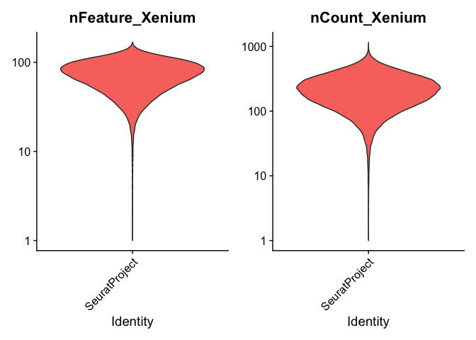
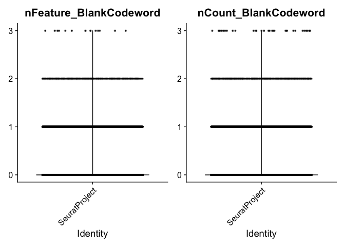
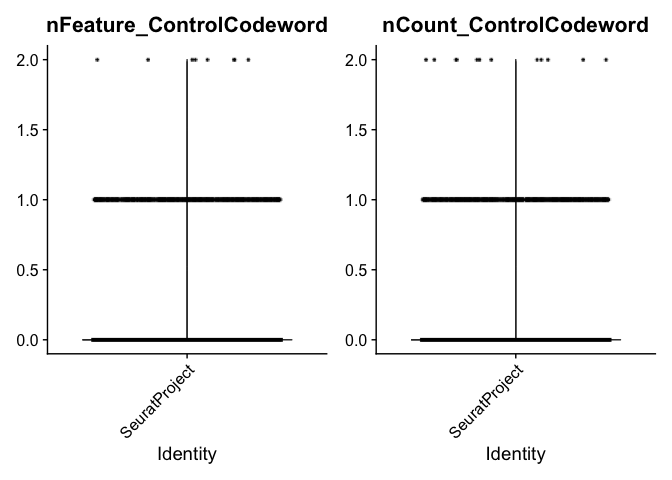
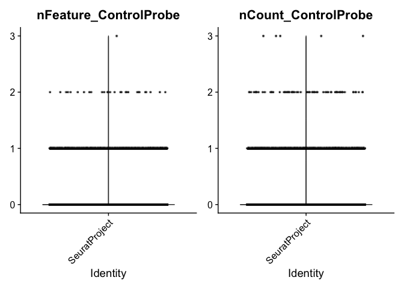
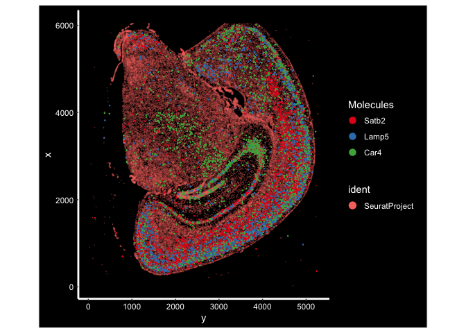
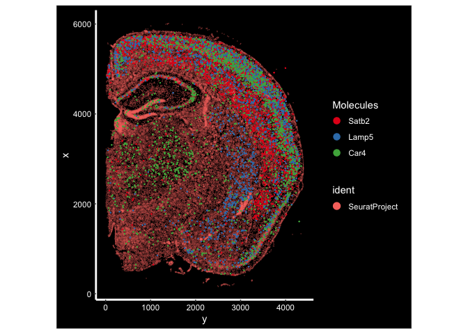
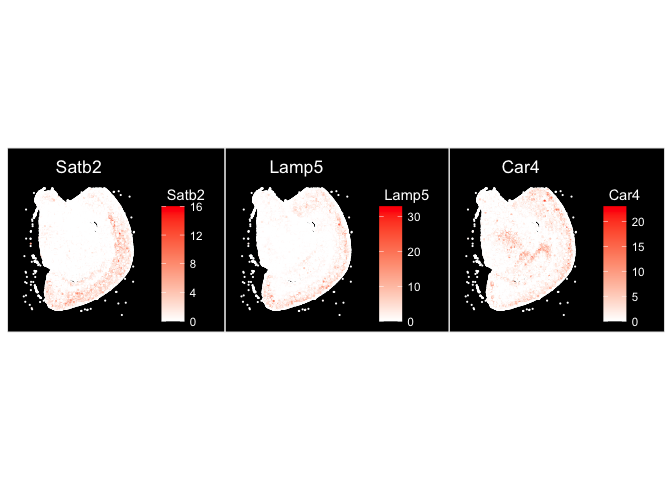
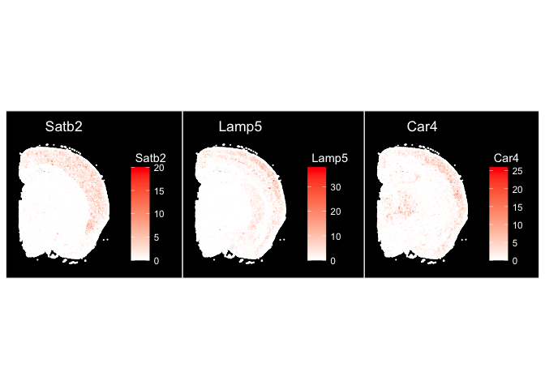
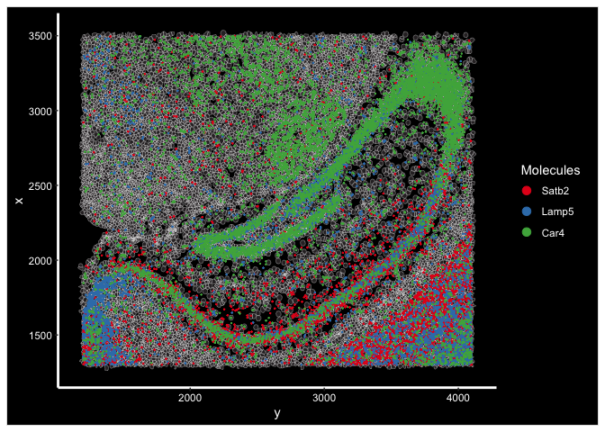
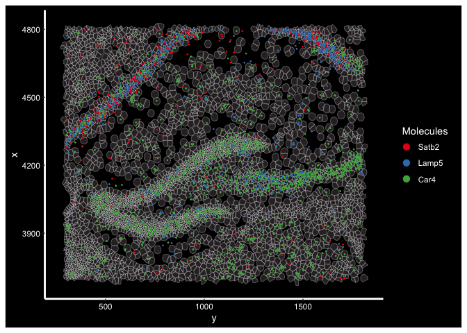

# Spatial Transcriptomics Part 1: Data Exploration


## Read the Xenium output into Seurat


``` r
library(Seurat)     # Spatial transcriptomics analysis
library(kableExtra) # format tables
library(ggplot2)   # create graphics
library(viridis)   # accessible color palettes
```

## Create Seurat object
[Seurat](http://satijalab.org/seurat/) is a popular R package that is designed for QC, analysis, and exploration of single cell data, and spatial single cell data. We will use Seurat in the first stage in analysis to carry out a series of standard procedures: read in spatial data, QC, normalization, dimensionality reduction, clustering and visualizations.
Seurat has an extensive documentation that covers many different use cases. In addition to the standard Seurat workflow, this documentation makes use of some custom code, and brings in functions from other packages. For additional information on Seurat standard workflows, see the authors' [tutorials](https://satijalab.org/seurat/articles/get_started_v5_new).

#### Read in spatial data and cell feature matrix

First, we read in data from each individual tissue folder and create Seurat objects.


``` r
## set up directories
data.dir <- "./00-RawData"
project.dir <- "./"

## samples
samples <- c("TgCRND8", "wildtype")
sample.dir <- paste0("Xenium_V1_FFPE_", samples, "_5_7_months_outs")

## modify "future.globals.maxSize" to accommodate larege data"
options(future.globals.maxSize = 2000 * 1024 ^ 2)
## load multiple slices
data.xenium <- lapply(seq_along(samples), function(i){
	## modify the fov slot names to distinguish fovs from different tissue samples for easier access later
	tmp <- Seurat::LoadXenium(data.dir = file.path(data.dir, sample.dir[i]), segmentations = "cell", cell.centroids = T, fov = paste0("fov.", samples[i]))
	## attach tissue sample name to cell names
	tmp <- RenameCells(tmp, new.names = paste0(samples[i], "-", Cells(tmp)))
	## add metadata to identify tissue samples
	tmp <- AddMetaData(tmp, metadata = samples[i], col.name = "Genotype")
	return(tmp)
})

for (i in seq_along(data.xenium)){
	if (i == 1){
		experiment.aggregate <- data.xenium[[i]]
	}else{
		experiment.aggregate <- merge(experiment.aggregate, data.xenium[[i]])
	}
}
```

## Explore the Seurat object

A Seurat object is a complex data structure containing the data from a spatial single cell assay and **all** of the information associated with the experiment, including annotations, analysis, and more. This data structure was developed by the authors of the Seurat analysis package, for use with their pipeline.


``` r
View(experiment.aggregate)
```

Most Seurat functions take the object as an argument, and return either a new Seurat object or a ggplot object (a visualization). As the analysis continues, more and more data will be added to the object.


``` r
slotNames(experiment.aggregate)
```

```
##  [1] "assays"       "meta.data"    "active.assay" "active.ident" "graphs"      
##  [6] "neighbors"    "reductions"   "images"       "project.name" "misc"        
## [11] "version"      "commands"     "tools"
```

``` r
experiment.aggregate@assays # a slot is accessed with the @ symbol
```

```
## $Xenium
## Assay (v5) data with 347 features for 117367 cells
## First 10 features:
##  2010300C02Rik, Abca7, Acsbg1, Acta2, Acvrl1, Adamts2, Adamtsl1, Adgrl4,
## Aldh1a2, Aldh1l1 
## Layers:
##  counts.1, counts.2 
## 
## $BlankCodeword
## Assay data with 126 features for 117367 cells
## First 10 features:
##  BLANK-0005, BLANK-0006, BLANK-0007, BLANK-0010, BLANK-0011, BLANK-0014,
## BLANK-0016, BLANK-0017, BLANK-0018, BLANK-0020 
## 
## $ControlCodeword
## Assay data with 41 features for 117367 cells
## First 10 features:
##  NegControlCodeword-0500, NegControlCodeword-0501,
## NegControlCodeword-0502, NegControlCodeword-0503,
## NegControlCodeword-0504, NegControlCodeword-0505,
## NegControlCodeword-0506, NegControlCodeword-0507,
## NegControlCodeword-0508, NegControlCodeword-0509 
## 
## $ControlProbe
## Assay data with 27 features for 117367 cells
## First 10 features:
##  NegControlProbe-00074, NegControlProbe-00073, NegControlProbe-00067,
## NegControlProbe-00062, NegControlProbe-00060, NegControlProbe-00059,
## NegControlProbe-00058, NegControlProbe-00057, NegControlProbe-00053,
## NegControlProbe-00048
```

- Which slots are empty, and which contain data?
- What type of object is the content of the meta.data slot?
- What metadata is available?

There is often more than one way to interact with the information stored in each of a Seurat objects' many slots. The default behaviors of different access functions are described in the help documentation.


``` r
# which slot is being accessed here? find another way to produce the result
head(experiment.aggregate[[]])
```

```
##                       orig.ident nCount_Xenium nFeature_Xenium
## TgCRND8-aaabaohn-1 SeuratProject           181              54
## TgCRND8-aaabocno-1 SeuratProject           294              72
## TgCRND8-aaadpgin-1 SeuratProject           155              48
## TgCRND8-aaaecjii-1 SeuratProject           282              79
## TgCRND8-aaaegkaj-1 SeuratProject           166              59
## TgCRND8-aaaghdog-1 SeuratProject           279              94
##                    nCount_BlankCodeword nFeature_BlankCodeword
## TgCRND8-aaabaohn-1                    0                      0
## TgCRND8-aaabocno-1                    0                      0
## TgCRND8-aaadpgin-1                    0                      0
## TgCRND8-aaaecjii-1                    0                      0
## TgCRND8-aaaegkaj-1                    0                      0
## TgCRND8-aaaghdog-1                    0                      0
##                    nCount_ControlCodeword nFeature_ControlCodeword
## TgCRND8-aaabaohn-1                      0                        0
## TgCRND8-aaabocno-1                      0                        0
## TgCRND8-aaadpgin-1                      0                        0
## TgCRND8-aaaecjii-1                      0                        0
## TgCRND8-aaaegkaj-1                      0                        0
## TgCRND8-aaaghdog-1                      0                        0
##                    nCount_ControlProbe nFeature_ControlProbe Genotype
## TgCRND8-aaabaohn-1                   0                     0  TgCRND8
## TgCRND8-aaabocno-1                   0                     0  TgCRND8
## TgCRND8-aaadpgin-1                   0                     0  TgCRND8
## TgCRND8-aaaecjii-1                   0                     0  TgCRND8
## TgCRND8-aaaegkaj-1                   0                     0  TgCRND8
## TgCRND8-aaaghdog-1                   0                     0  TgCRND8
```

The use of syntax is often a matter of personal preference. In the interest of clarity, this documentation will generally use the more explicit syntax, with a few exceptions.

## QC visuzalization


``` r
## genes: designed probes for the gene panel
VlnPlot(experiment.aggregate, features = c("nFeature_Xenium", "nCount_Xenium"), ncol = 2, pt.size = 0, log = T)
```

<!-- -->

``` r
## blank, unassigned codewords: are unused codewords. No probe in the corresponding gene panel that will generate the codeword
VlnPlot(experiment.aggregate, features = c("nFeature_BlankCodeword", "nCount_BlankCodeword"), ncol = 2, pt.size = 0.01)
```

<!-- -->

``` r
## negative control codewords: codewords that do not have any probes matching that code. They are used to assess the specificity of the decoding algoritm
VlnPlot(experiment.aggregate, features = c("nFeature_ControlCodeword", "nCount_ControlCodeword"), ncol = 2, pt.size = 0.01)
```

<!-- -->

``` r
## control, negative control probe: probes that exist in the panel but do not target any biological sequences. They are used to assess the specificity of the assay
VlnPlot(experiment.aggregate, features = c("nFeature_ControlProbe", "nCount_ControlProbe"), ncol = 2, pt.size = 0.01)
```

<!-- -->

``` r
## genomic control: designed to bind to intergenic genomic DNA but not to any transcript sequence present in the tissue. They are present in the Xenium Prime 5K assay, but not in other Xenium assays.
```

## Exploratory visualizations


``` r
## plot expression for genes of interest
ImageDimPlot(experiment.aggregate, fov = "fov.wildtype", molecules = c("Satb2", "Lamp5", "Car4"), group.by = NULL, size = 0.5, alpha = 0.5, axes = T)
```

<!-- -->

``` r
ImageDimPlot(experiment.aggregate, fov = "fov.TgCRND8", molecules = c("Satb2", "Lamp5", "Car4"), group.by = NULL, size = 0.5, alpha = 0.5, axes = T)
```

<!-- -->

``` r
ImageFeaturePlot(experiment.aggregate, fov = "fov.wildtype", features = c("Satb2", "Lamp5", "Car4"), size = 0.75, cols = c("white", "red"))
```

<!-- -->

``` r
ImageFeaturePlot(experiment.aggregate, fov = "fov.TgCRND8", features = c("Satb2", "Lamp5", "Car4"), size = 0.75, cols = c("white", "red"))
```

<!-- -->

``` r
## zoom in on specific regions
wildtype.subfov.1 <- Crop(experiment.aggregate[["fov.wildtype"]], y = c(1300, 3500), x = c(1200, 4100), coords = "plot")
experiment.aggregate[["wildtype.subfov.1"]] <- wildtype.subfov.1
DefaultBoundary(experiment.aggregate[["wildtype.subfov.1"]]) <- "segmentation"
ImageDimPlot(experiment.aggregate, fov = "wildtype.subfov.1", axes = T, border.color = "white", border.size = 0.1, cols = "polychrome",
	coord.fixed = F, molecules = c("Satb2", "Lamp5", "Car4"), alpha = 0.5, nmols = 10000)
```

<!-- -->

``` r
TgCRND8.subfov.1 <- Crop(experiment.aggregate[["fov.TgCRND8"]], y = c(3700, 4800), x = c(300, 1800), coords = "plot")
experiment.aggregate[["TgCRND8.subfov.1"]] <- TgCRND8.subfov.1
DefaultBoundary(experiment.aggregate[["TgCRND8.subfov.1"]]) <- "segmentation"
ImageDimPlot(experiment.aggregate, fov = "TgCRND8.subfov.1", axes = T, border.color = "white", border.size = 0.1, cols = "polychrome",
	coord.fixed = F, molecules = c("Satb2", "Lamp5", "Car4"), alpha = 0.5, nmols = 10000)
```

<!-- -->

## Prepare for the next section

#### Save object

``` r
saveRDS(experiment.aggregate, file="Spatial_workshop-01.rds")
```

#### Download Rmd

``` r
download.file("https://raw.githubusercontent.com/ucdavis-bioinformatics-training/2025-March-Spatial-Transcriptomics/main/data_analysis/02-Clustering.Rmd", "02-Clustering.Rmd")
```

#### Session information

``` r
sessionInfo()
```

```
## R version 4.4.3 (2025-02-28)
## Platform: aarch64-apple-darwin20
## Running under: macOS Ventura 13.7.1
## 
## Matrix products: default
## BLAS:   /Library/Frameworks/R.framework/Versions/4.4-arm64/Resources/lib/libRblas.0.dylib 
## LAPACK: /Library/Frameworks/R.framework/Versions/4.4-arm64/Resources/lib/libRlapack.dylib;  LAPACK version 3.12.0
## 
## locale:
## [1] en_US.UTF-8/en_US.UTF-8/en_US.UTF-8/C/en_US.UTF-8/en_US.UTF-8
## 
## time zone: America/Los_Angeles
## tzcode source: internal
## 
## attached base packages:
## [1] stats     graphics  grDevices utils     datasets  methods   base     
## 
## other attached packages:
## [1] viridis_0.6.5      viridisLite_0.4.2  ggplot2_3.5.1      kableExtra_1.4.0  
## [5] Seurat_5.2.1       SeuratObject_5.0.2 sp_2.1-4          
## 
## loaded via a namespace (and not attached):
##   [1] RColorBrewer_1.1-3     rstudioapi_0.16.0      jsonlite_1.8.8        
##   [4] magrittr_2.0.3         ggbeeswarm_0.7.2       spatstat.utils_3.1-2  
##   [7] farver_2.1.2           rmarkdown_2.27         vctrs_0.6.5           
##  [10] ROCR_1.0-11            Cairo_1.6-2            spatstat.explore_3.2-7
##  [13] htmltools_0.5.8.1      sass_0.4.9             sctransform_0.4.1     
##  [16] parallelly_1.37.1      KernSmooth_2.23-26     bslib_0.7.0           
##  [19] htmlwidgets_1.6.4      ica_1.0-3              plyr_1.8.9            
##  [22] plotly_4.10.4          zoo_1.8-12             cachem_1.1.0          
##  [25] igraph_2.0.3           mime_0.12              lifecycle_1.0.4       
##  [28] pkgconfig_2.0.3        Matrix_1.7-2           R6_2.5.1              
##  [31] fastmap_1.2.0          fitdistrplus_1.1-11    future_1.33.2         
##  [34] shiny_1.8.1.1          digest_0.6.35          colorspace_2.1-0      
##  [37] patchwork_1.2.0        tensor_1.5             RSpectra_0.16-1       
##  [40] irlba_2.3.5.1          labeling_0.4.3         progressr_0.14.0      
##  [43] fansi_1.0.6            spatstat.sparse_3.0-3  httr_1.4.7            
##  [46] polyclip_1.10-6        abind_1.4-5            compiler_4.4.3        
##  [49] proxy_0.4-27           bit64_4.0.5            withr_3.0.0           
##  [52] DBI_1.2.3              fastDummies_1.7.3      highr_0.11            
##  [55] R.utils_2.12.3         MASS_7.3-64            classInt_0.4-11       
##  [58] units_0.8-7            tools_4.4.3            vipor_0.4.7           
##  [61] lmtest_0.9-40          beeswarm_0.4.0         httpuv_1.6.15         
##  [64] future.apply_1.11.2    goftest_1.2-3          R.oo_1.26.0           
##  [67] glue_1.7.0             nlme_3.1-167           promises_1.3.0        
##  [70] sf_1.0-19              grid_4.4.3             Rtsne_0.17            
##  [73] cluster_2.1.8          reshape2_1.4.4         generics_0.1.3        
##  [76] hdf5r_1.3.10           gtable_0.3.5           spatstat.data_3.0-4   
##  [79] class_7.3-23           R.methodsS3_1.8.2      tidyr_1.3.1           
##  [82] data.table_1.15.4      xml2_1.3.6             utf8_1.2.4            
##  [85] spatstat.geom_3.2-9    RcppAnnoy_0.0.22       ggrepel_0.9.5         
##  [88] RANN_2.6.1             pillar_1.9.0           stringr_1.5.1         
##  [91] spam_2.10-0            RcppHNSW_0.6.0         later_1.3.2           
##  [94] splines_4.4.3          dplyr_1.1.4            lattice_0.22-6        
##  [97] bit_4.0.5              survival_3.8-3         deldir_2.0-4          
## [100] tidyselect_1.2.1       miniUI_0.1.1.1         pbapply_1.7-2         
## [103] knitr_1.47             gridExtra_2.3          svglite_2.1.3         
## [106] scattermore_1.2        xfun_0.44              matrixStats_1.3.0     
## [109] stringi_1.8.4          lazyeval_0.2.2         yaml_2.3.8            
## [112] evaluate_0.23          codetools_0.2-20       tibble_3.2.1          
## [115] cli_3.6.2              uwot_0.2.2             arrow_16.1.0          
## [118] xtable_1.8-4           reticulate_1.39.0      systemfonts_1.1.0     
## [121] munsell_0.5.1          jquerylib_0.1.4        Rcpp_1.0.12           
## [124] globals_0.16.3         spatstat.random_3.2-3  png_0.1-8             
## [127] ggrastr_1.0.2          parallel_4.4.3         assertthat_0.2.1      
## [130] dotCall64_1.1-1        listenv_0.9.1          e1071_1.7-14          
## [133] scales_1.3.0           ggridges_0.5.6         purrr_1.0.2           
## [136] rlang_1.1.3            cowplot_1.1.3
```
