# Spatial Transcriptomics Part 2: Clustering


## Set up the workspace


``` r
library(Seurat)     # Spatial transcriptomics analysis
library(kableExtra) # format tables
library(ggplot2)   # create graphics
library(viridis)   # accessible color palettes
```

If you are continuing directly from part 1, the experiment.aggregate object is likely already in your workspace. In case you cleared your workspace at the end of the previous section, or are working on this project at a later date after re-starting R, you can use the readRDS function to read your saved Seurat object from part 1.


``` r
experiment.aggregate <- readRDS("Spatial_workshop-01.rds")
```

Recall the QC visualizations we did in part 2. The quality of cells are reflected in a series of features that are different from single cell RNA-Seq data. For image based spatial transcriptomics, there are a few metrics used to control the background noise and decoding accuracy.

* negative control codewords: codewords that do not have any probes matching to. They are chosen to assess the specificity of the decoding algorithm that assign the raw quality score to transcripts.
* blank/unassigned codewords: codewords that no probe in a gene panel will generate
* negative control probes: probes that exist in the gene panels but target non-biological sequences. They are used to assess the specificity of the assay.
* genomic control probes: probes that are designed to bind to intergenic genomic DNA but not to any transcript sequence. They are present in the Xenium Prime assay

The Xenium Onboard Analysis transcripts output only include the transcripts that meet the requirement of Q-Score of 20. The quality control remaining is to identify the high quality cells. The one important metric used to assess cell quality is the number of transcripts detected. The value of this metric is highly dependent on the size of the gene panel used in the assay.


``` r
experiment.aggregate <- subset(experiment.aggregate, subset = nCount_Xenium > 20)
```

## Normalization

Normalization is an important step in all gene expression analysis. The best normalization for spatial single cell data set is still an area of active development. There have been studies that were set to evaluate the different approaches. Please read the following manuscripts to learn more about this area: [Bhuva et. al.](https://genomebiology.biomedcentral.com/articles/10.1186/s13059-024-03241-7) and [Atta et. al.](https://genomebiology.biomedcentral.com/articles/10.1186/s13059-024-03303-w).

Two normalization approaches are available in Seurat. One is the global-normalization method LogNormalize that normalizes the expression measurements for each cell by the total expression, multiplies this by a scaling factor of 10000 and log-transforms the results. The second is the SCTransform method where it performs gene-specific adjustments of expression measurements by regressing out the effect of library size using a generalized linear model framework.


``` r
## first, let's take a look at the function SCTranform itself
?SCTransform

## normalize
experiment.aggregate <- SCTransform(experiment.aggregate, assay = "Xenium")
```

## Dimentionality reduction

Single cell resolution data are extremely high-dimensional. In order to reduce the complexity of analysis and remove sources of noise, dimensionality reduction is an important step in the analysis workflow. In this section, we will be using two dimension reduction methods: PCA and UMAP.

Principal Components Analysis (PCA) is a widely-used dimension reduction method. Each PC is a vector in the reduced-dimensional space that is orthogonal to all preceding PCs. The first of these explains the largest amount of variation and each subsequent PC explains slightly less than the preceding component. PCA is performed on the scaled data, and therefore uses only the variable features.

[Uniform Manifold Approximation and Projection](https://arxiv.org/pdf/1802.03426v3.pdf) (UMAP) is a dimensionality reduction method that is commonly used in single cell data analysis. Single cell data is extremely high-dimensional; UMAP calculates a nearest neighbor network describing the relationships between cells as measured by the PC loadings of variable genes and creates a lower-dimensional space that preserves these relationships.


``` r
## linear
experiment.aggregate <- RunPCA(experiment.aggregate, npcs = 30, features = rownames(experiment.aggregate))
DimPlot(experiment.aggregate, reduction = "pca", group.by = "Genotype")
```

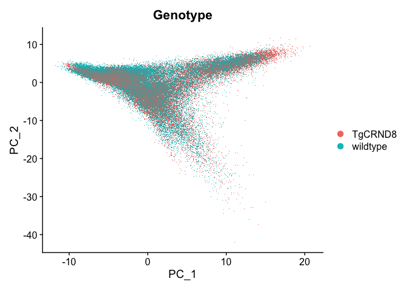<!-- -->

``` r
## non-linear
experiment.aggregate <- RunUMAP(experiment.aggregate, dims = 1:30)
DimPlot(experiment.aggregate, reduction = "umap", group.by = "Genotype")
```

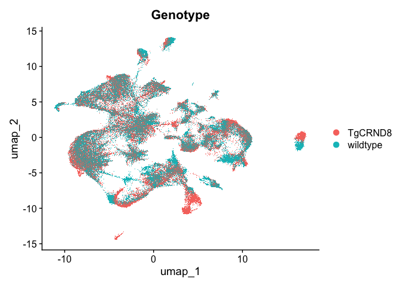<!-- -->

## Clustering

Clustering is a critical step in single cell experiments, which is designed to capture the heterogeneity within samples as well as between them. Clustering permits the user to organize cells into clusters that correspond to biologically and experimentally relevant populations.

Seurat implements an graph-based clustering approach. Distances between the cells are calculated based on previously identified PCs.

The default method for identifying k-nearest neighbors is [annoy](https://github.com/spotify/annoy), an approximate nearest-neighbor approach that is widely used for high-dimensional analysis in many fields, including single-cell analysis. Extensive community benchmarking has shown that annoy substantially improves the speed and memory requirements of neighbor discovery, with negligible impact to downstream results.

The FindClusters function implements the neighbor based clustering procedure, and contains a resolution parameter that sets the granularity of the downstream clustering, with increased values leading to a greater number of clusters. This code produces a series of resolutions for us to investigate and choose from. The clustering resolution parameter is unit-less and somewhat arbitrary. The resolutions used here were selected to produce a useable number of clusters in the example experiment.


``` r
experiment.aggregate <- FindNeighbors(experiment.aggregate, reduction = "pca", dims = 1:30)
experiment.aggregate <- FindClusters(experiment.aggregate, resolution = c(0.3, 0.5))
```

```
## Modularity Optimizer version 1.3.0 by Ludo Waltman and Nees Jan van Eck
## 
## Number of nodes: 116549
## Number of edges: 4237943
## 
## Running Louvain algorithm...
## Maximum modularity in 10 random starts: 0.9516
## Number of communities: 22
## Elapsed time: 35 seconds
## Modularity Optimizer version 1.3.0 by Ludo Waltman and Nees Jan van Eck
## 
## Number of nodes: 116549
## Number of edges: 4237943
## 
## Running Louvain algorithm...
## Maximum modularity in 10 random starts: 0.9382
## Number of communities: 26
## Elapsed time: 37 seconds
```

### Visualize clustering

Seurat adds the clustering information to the metadata table. Each FindClusters call generates a new column named with the assay, followed by "_snn_res.", and the resolution.


``` r
cluster.resolutions <- grep("res", colnames(experiment.aggregate@meta.data), value = TRUE)
head(experiment.aggregate@meta.data[,cluster.resolutions]) %>%
  kable(caption = 'Cluster identities are added to the meta.data slot.') %>%
  kable_styling("striped")
```

<table class="table table-striped" style="margin-left: auto; margin-right: auto;">
<caption>Cluster identities are added to the meta.data slot.</caption>
 <thead>
  <tr>
   <th style="text-align:left;">  </th>
   <th style="text-align:left;"> SCT_snn_res.0.3 </th>
   <th style="text-align:left;"> SCT_snn_res.0.5 </th>
  </tr>
 </thead>
<tbody>
  <tr>
   <td style="text-align:left;"> TgCRND8-aaabaohn-1 </td>
   <td style="text-align:left;"> 2 </td>
   <td style="text-align:left;"> 1 </td>
  </tr>
  <tr>
   <td style="text-align:left;"> TgCRND8-aaabocno-1 </td>
   <td style="text-align:left;"> 3 </td>
   <td style="text-align:left;"> 5 </td>
  </tr>
  <tr>
   <td style="text-align:left;"> TgCRND8-aaadpgin-1 </td>
   <td style="text-align:left;"> 2 </td>
   <td style="text-align:left;"> 1 </td>
  </tr>
  <tr>
   <td style="text-align:left;"> TgCRND8-aaaecjii-1 </td>
   <td style="text-align:left;"> 3 </td>
   <td style="text-align:left;"> 6 </td>
  </tr>
  <tr>
   <td style="text-align:left;"> TgCRND8-aaaegkaj-1 </td>
   <td style="text-align:left;"> 0 </td>
   <td style="text-align:left;"> 0 </td>
  </tr>
  <tr>
   <td style="text-align:left;"> TgCRND8-aaaghdog-1 </td>
   <td style="text-align:left;"> 3 </td>
   <td style="text-align:left;"> 6 </td>
  </tr>
</tbody>
</table>

#### UMAP

Dimensionality reduction plots can be used to visualize the clustering results. On these plots, we can see how each clustering resolution aligns with patterns in the data revealed by dimensionality reductions.


``` r
# UMAP colored by cluster
lapply(cluster.resolutions, function(res){
  DimPlot(experiment.aggregate,
          group.by = res,
          reduction = "umap",
          shuffle = TRUE) +
    scale_color_viridis_d(option = "turbo")
})
```

```
## [[1]]
```

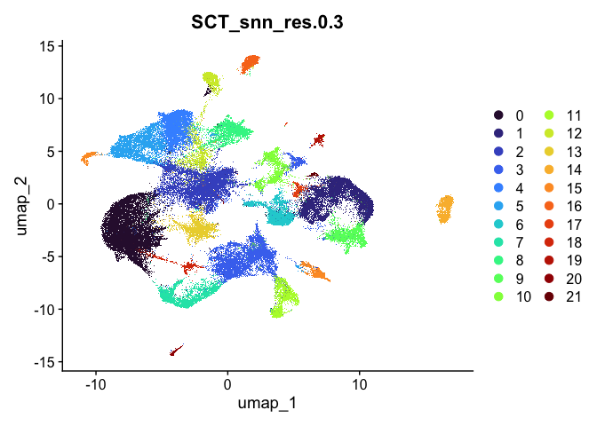<!-- -->

```
## 
## [[2]]
```

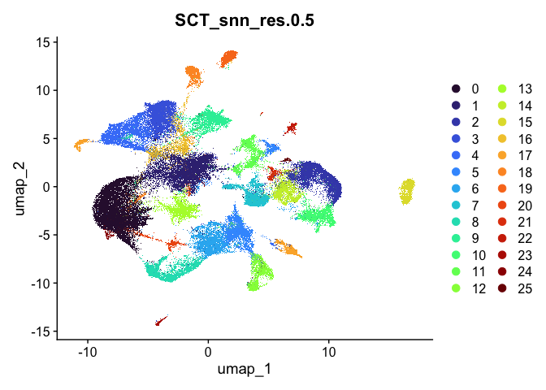<!-- -->

### Investigate the relationship between cluster identity and sample identity


``` r
lapply(cluster.resolutions, function(res){
         tmp = experiment.aggregate@meta.data[,c(res, "Genotype")]
         colnames(tmp) = c("cluster", "Genotype")
         ggplot(tmp, aes(x = cluster, fill = Genotype)) +
           geom_bar() +
           scale_fill_viridis_d(option = "mako") +
           theme_classic()
})
```

```
## [[1]]
```

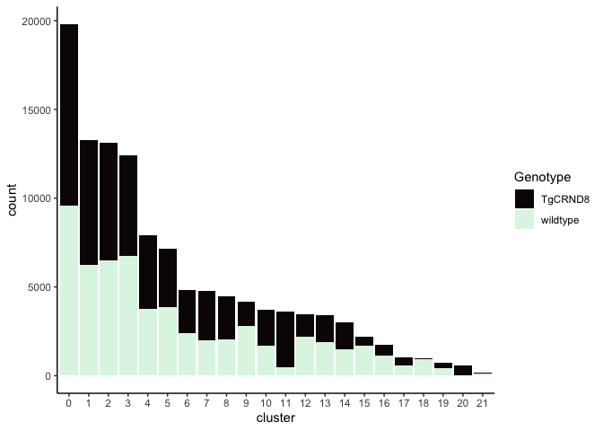<!-- -->

```
## 
## [[2]]
```

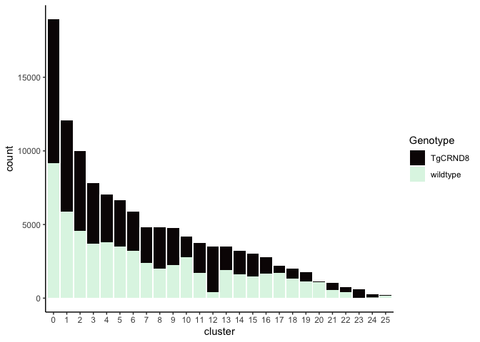<!-- -->

### Investigate the relationship between cluster identity and metadata values

Here, example plots are displayed for the lowest resolution in order to save space. To see plots for each resolution, use `lapply()`.


``` r
VlnPlot(experiment.aggregate,
        group.by = "SCT_snn_res.0.3",
        features = "nCount_Xenium",
        pt.size = 0.1) +
  scale_fill_viridis_d(option = "turbo")
```

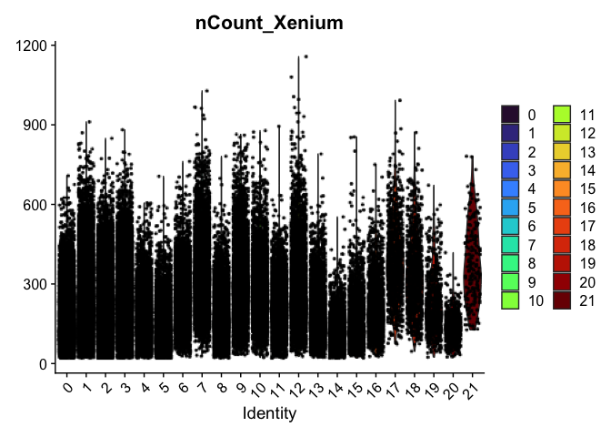<!-- -->

### Visualize expression of genes of interest


``` r
FeaturePlot(experiment.aggregate,
            reduction = "umap",
            features = "Satb2")
```

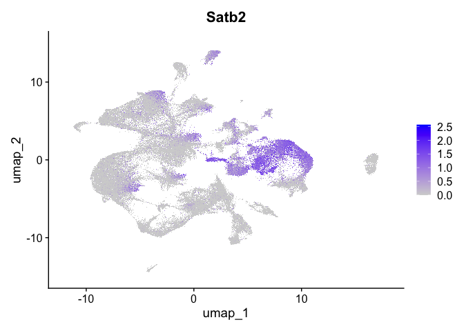<!-- -->

``` r
VlnPlot(experiment.aggregate,
        group.by = "SCT_snn_res.0.3",
        features = "Satb2",
        pt.size = 0.1) +
  scale_fill_viridis_d(option = "turbo")
```

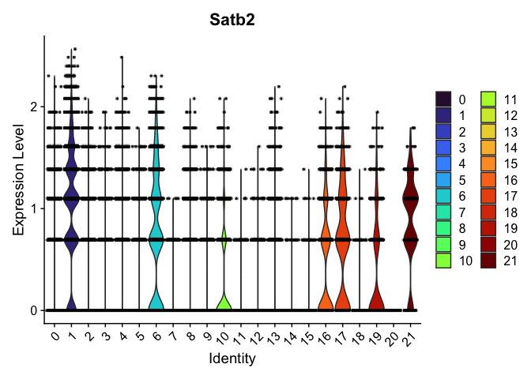<!-- -->

### Visualize the clusters under spatial context


``` r
ImageDimPlot(experiment.aggregate, fov = "fov.wildtype", group.by = "SCT_snn_res.0.3", size = 0.3, axes = T)
```

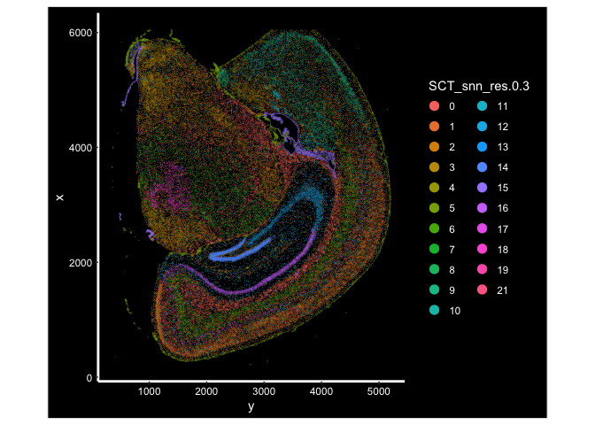<!-- -->

``` r
ImageDimPlot(experiment.aggregate, fov = "fov.TgCRND8", group.by = "SCT_snn_res.0.3", size = 0.3, axes = T)
```

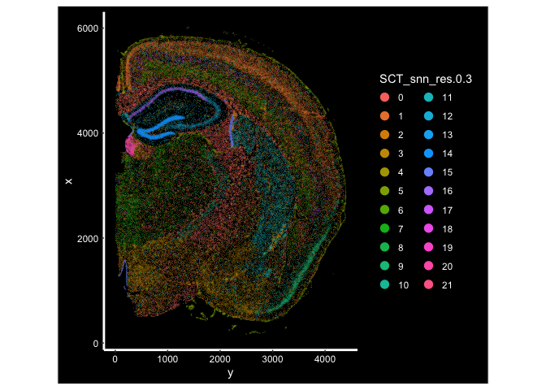<!-- -->

## Prepare for the next section

#### Save object

``` r
saveRDS(experiment.aggregate, file="Spatial_workshop-02.rds")
```

#### Download Rmd

``` r
download.file("https://raw.githubusercontent.com/ucdavis-bioinformatics-training/2025-March-Spatial-Transcriptomics/main/data_analysis/03-Celltype.Rmd", "03-Celltype.Rmd")
```

#### Session information

``` r
sessionInfo()
```

```
## R version 4.4.3 (2025-02-28)
## Platform: aarch64-apple-darwin20
## Running under: macOS Ventura 13.7.1
## 
## Matrix products: default
## BLAS:   /Library/Frameworks/R.framework/Versions/4.4-arm64/Resources/lib/libRblas.0.dylib 
## LAPACK: /Library/Frameworks/R.framework/Versions/4.4-arm64/Resources/lib/libRlapack.dylib;  LAPACK version 3.12.0
## 
## locale:
## [1] en_US.UTF-8/en_US.UTF-8/en_US.UTF-8/C/en_US.UTF-8/en_US.UTF-8
## 
## time zone: America/Los_Angeles
## tzcode source: internal
## 
## attached base packages:
## [1] stats     graphics  grDevices utils     datasets  methods   base     
## 
## other attached packages:
## [1] viridis_0.6.5      viridisLite_0.4.2  ggplot2_3.5.1      kableExtra_1.4.0  
## [5] Seurat_5.2.1       SeuratObject_5.0.2 sp_2.1-4          
## 
## loaded via a namespace (and not attached):
##   [1] RColorBrewer_1.1-3          rstudioapi_0.16.0          
##   [3] jsonlite_1.8.8              magrittr_2.0.3             
##   [5] ggbeeswarm_0.7.2            spatstat.utils_3.1-2       
##   [7] farver_2.1.2                rmarkdown_2.27             
##   [9] zlibbioc_1.50.0             vctrs_0.6.5                
##  [11] ROCR_1.0-11                 Cairo_1.6-2                
##  [13] DelayedMatrixStats_1.26.0   spatstat.explore_3.2-7     
##  [15] S4Arrays_1.6.0              htmltools_0.5.8.1          
##  [17] SparseArray_1.6.2           sass_0.4.9                 
##  [19] sctransform_0.4.1           parallelly_1.37.1          
##  [21] KernSmooth_2.23-26          bslib_0.7.0                
##  [23] htmlwidgets_1.6.4           ica_1.0-3                  
##  [25] plyr_1.8.9                  plotly_4.10.4              
##  [27] zoo_1.8-12                  cachem_1.1.0               
##  [29] igraph_2.0.3                mime_0.12                  
##  [31] lifecycle_1.0.4             pkgconfig_2.0.3            
##  [33] Matrix_1.7-2                R6_2.5.1                   
##  [35] fastmap_1.2.0               GenomeInfoDbData_1.2.12    
##  [37] MatrixGenerics_1.16.0       fitdistrplus_1.1-11        
##  [39] future_1.33.2               shiny_1.8.1.1              
##  [41] digest_0.6.35               colorspace_2.1-0           
##  [43] patchwork_1.2.0             S4Vectors_0.44.0           
##  [45] tensor_1.5                  RSpectra_0.16-1            
##  [47] irlba_2.3.5.1               GenomicRanges_1.56.0       
##  [49] labeling_0.4.3              progressr_0.14.0           
##  [51] fansi_1.0.6                 spatstat.sparse_3.0-3      
##  [53] httr_1.4.7                  polyclip_1.10-6            
##  [55] abind_1.4-5                 compiler_4.4.3             
##  [57] withr_3.0.0                 fastDummies_1.7.3          
##  [59] highr_0.11                  MASS_7.3-64                
##  [61] DelayedArray_0.30.1         tools_4.4.3                
##  [63] vipor_0.4.7                 lmtest_0.9-40              
##  [65] beeswarm_0.4.0              httpuv_1.6.15              
##  [67] future.apply_1.11.2         goftest_1.2-3              
##  [69] glmGamPoi_1.18.0            glue_1.7.0                 
##  [71] nlme_3.1-167                promises_1.3.0             
##  [73] grid_4.4.3                  Rtsne_0.17                 
##  [75] cluster_2.1.8               reshape2_1.4.4             
##  [77] generics_0.1.3              gtable_0.3.5               
##  [79] spatstat.data_3.0-4         tidyr_1.3.1                
##  [81] data.table_1.15.4           XVector_0.44.0             
##  [83] xml2_1.3.6                  utf8_1.2.4                 
##  [85] BiocGenerics_0.50.0         spatstat.geom_3.2-9        
##  [87] RcppAnnoy_0.0.22            ggrepel_0.9.5              
##  [89] RANN_2.6.1                  pillar_1.9.0               
##  [91] stringr_1.5.1               spam_2.10-0                
##  [93] RcppHNSW_0.6.0              later_1.3.2                
##  [95] splines_4.4.3               dplyr_1.1.4                
##  [97] lattice_0.22-6              survival_3.8-3             
##  [99] deldir_2.0-4                tidyselect_1.2.1           
## [101] miniUI_0.1.1.1              pbapply_1.7-2              
## [103] knitr_1.47                  gridExtra_2.3              
## [105] IRanges_2.38.0              SummarizedExperiment_1.34.0
## [107] svglite_2.1.3               scattermore_1.2            
## [109] stats4_4.4.3                xfun_0.44                  
## [111] Biobase_2.64.0              matrixStats_1.3.0          
## [113] UCSC.utils_1.0.0            stringi_1.8.4              
## [115] lazyeval_0.2.2              yaml_2.3.8                 
## [117] evaluate_0.23               codetools_0.2-20           
## [119] tibble_3.2.1                cli_3.6.2                  
## [121] uwot_0.2.2                  xtable_1.8-4               
## [123] reticulate_1.39.0           systemfonts_1.1.0          
## [125] munsell_0.5.1               jquerylib_0.1.4            
## [127] GenomeInfoDb_1.40.1         Rcpp_1.0.12                
## [129] globals_0.16.3              spatstat.random_3.2-3      
## [131] png_0.1-8                   ggrastr_1.0.2              
## [133] parallel_4.4.3              dotCall64_1.1-1            
## [135] sparseMatrixStats_1.16.0    listenv_0.9.1              
## [137] scales_1.3.0                ggridges_0.5.6             
## [139] crayon_1.5.2                purrr_1.0.2                
## [141] rlang_1.1.3                 cowplot_1.1.3
```
