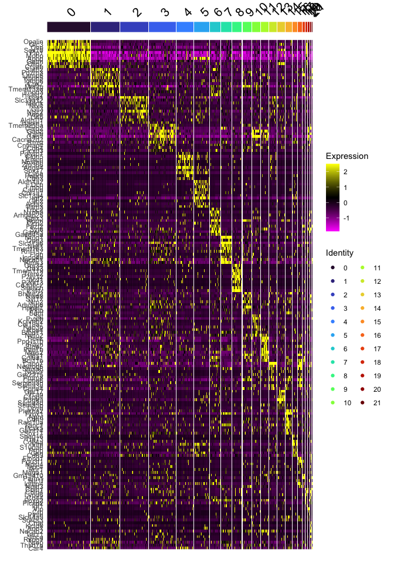
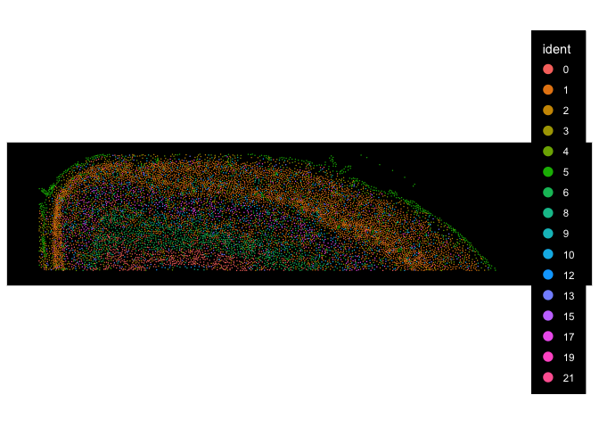
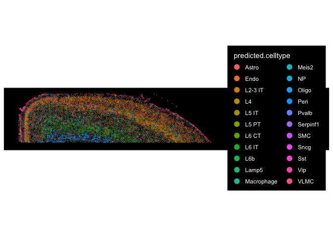
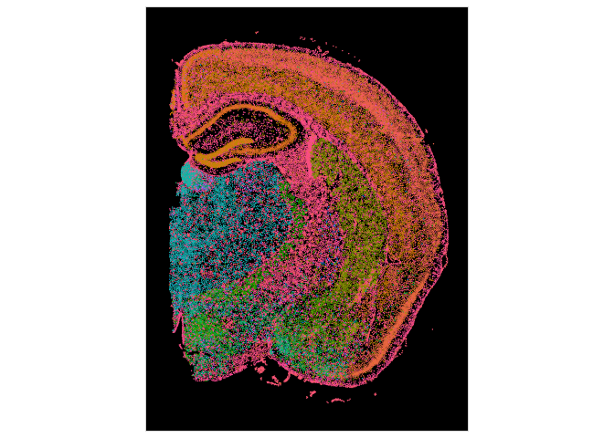

# Spatial Transcriptomics Part 3: Cell type annotation


## Set up the workspace


``` r
library(Seurat)     # Spatial transcriptomics analysis
library(kableExtra) # format tables
library(ggplot2)   # create graphics
library(viridis)   # accessible color palettes
library(spacexr)  # cell type identification
library(scCustomize)  # data type conversion
```

If you are continuing directly from part 2, the experiment.aggregate object is likely already in your workspace. In case you cleared your workspace at the end of the previous section, or are working on this project at a later date after re-starting R, you can use the readRDS function to read your saved Seurat object from part 2.


``` r
experiment.aggregate <- readRDS("Spatial_workshop-02.rds")
```

Identifying the cell type present in the data is the most obvious objective of a spatial single cell experiment. And it enables the assessment of the cell type heterogeniety in the tissue and the differences across tissues/experimental conditions, as well as many other more sophisticated analysis, such as niche analysis, cell-cell interaction analysis that we will discuss later.

In single cell RNASeq experiments, there are two main approaches available for cell type annotations. One uses known marker genes to classify cells into different categories. The other uses existing data set or atlas that are composed of the same cell types to transfer cell type labels.

There are two ways to use known cell type markers. One could use the list of cell type markers and match them to cluster markers to label each cluster to a cell type.


``` r
## choose the resolution
Idents(experiment.aggregate) <- "SCT_snn_res.0.3"
```

By default, when we ran SCTransform on the merged Seurat object, it was run on each tissue slice individually.


``` r
?PrepSCTFindMarkers

slot(object = experiment.aggregate@assays$SCT@SCTModel.list[[2]], name = "umi.assay") <- "Xenium"

experiment.aggregate <- PrepSCTFindMarkers(experiment.aggregate, assay = "SCT")
```


``` r
## find cluster markers
markers <- FindAllMarkers(experiment.aggregate,
		only.pos = TRUE,    
		min.pct = 0.25,
		thresh.use = 0.25)

## pick the top 10 genes per cluster to visualize
top10 <- markers %>% dplyr::group_by(cluster) %>% dplyr::slice_max(n = 10, order_by = avg_log2FC)

DoHeatmap(experiment.aggregate,
          group.by = "SCT_snn_res.0.3",
          features = top10$gene,
          group.colors = viridis::turbo(length(unique(experiment.aggregate$SCT_snn_res.0.3))))
```

<!-- -->

By comparing the cluster markers to expected marker gene expression, one can classify each cluster to a cell type.

Alternatively, one may use methods that have developed for single cell RNASeq cell type annotation to create cell type labels. Two of these methods have been covered in our Introduction to Single Cell RNA-Seq data analysis workshops: [scMRMA](https://academic.oup.com/nar/article/50/2/e7/6396893) and [scType](https://www.nature.com/articles/s41467-022-28803-w). Both methods utilize existing data bases of cell type markers. scMRMA (single cell Multi-Resolution Marker-based Annotation Algorighm) classifies cells by iteratively clustering them then annotating based on a hierarchical external database. scType also uses an external data base of cell type markers. It calculates a normalized score for each cell and identifies the cell type by taking the largest score that is above a threshold. Please refer to the documentations for our previous Introduction to Single Cell RNA-Seq data analysis workshop for how to use these two methods: [scMRMA](https://ucdavis-bioinformatics-training.github.io/2022-December-Single-Cell-RNA-Seq-Analysis/data_analysis/scRNA_Workshop-PART5_with_quizzes), [scType](https://ucdavis-bioinformatics-training.github.io/2024-December-Single-Cell-RNA-Seq-Analysis/data_analysis/05-clustering_celltype). These methods may suffer from their limited set of cell type markers.

When there are available single cell RNA-Seq data sets that have annotated cell types, one may transfer the labels from the single cell data to the spatial transcriptomics data. Seurat supports the [Robust Cell Type Decomposition](https://www.nature.com/articles/s41587-021-00830-w), a computational approach to deconvolute spot-level data from spatial datasets when provided with an scRNA-seq reference.

Here we are going to subset the data to only the cortex region from the TgCRND8 Alzheimer's Disease model tissue slice so that we can use the Allen Brain Atlas cortex data to annotate the cells.

First, please download "allen_cortex.rds" from _/share/workshop/Spatial_scRNA_workshop/Data/_ using command line _scp_, or _FileZilla_.


``` r
## create subset cells
cropped <- Crop(experiment.aggregate[["fov.TgCRND8"]], x = c(100, 4000), y = c(4900, 5800), coords = c("plot"))
experiment.aggregate[["cropped"]] <- cropped

## visualize subsetted section
ImageDimPlot(experiment.aggregate, fov = "cropped")
```

<!-- -->

``` r
## subset Seurat object for cortex region in TgCRND8 tissue
experiment.joined <- JoinLayers(experiment.aggregate, assay = "Xenium")
cortex.counts <- LayerData(experiment.joined, layer = "counts")[, Cells(experiment.aggregate[["cropped"]])]
cortex.coords <- GetTissueCoordinates(experiment.aggregate[["cropped"]], which = "centroids")
rownames(cortex.coords) <- cortex.coords$cell
cortex.coords$cell <- NULL
cortex.query <- SpatialRNA(cortex.coords, cortex.counts, colSums(cortex.counts))

## prepare the reference using the downloaded allen_cortex.rds
cortex.ref <- readRDS("./allen_cortex.rds")
cortex.ref <- UpdateSeuratObject(cortex.ref)

Idents(cortex.ref) <- "subclass"
cortex.ref <- subset(cortex.ref, subset = subclass != "CR")
counts <- GetAssayData(cortex.ref, assay = "RNA", slot = "counts")
cluster <- as.factor(cortex.ref$subclass)
names(cluster) <- colnames(cortex.ref)
nUMI <- cortex.ref$nCount_RNA
names(nUMI) <- colnames(cortex.ref)
nUMI <- colSums(counts)
levels(cluster) <- gsub("/", "-", levels(cluster))
reference <- Reference(counts, cluster, nUMI)

## run RCTD with multiple cores
RCTD <- create.RCTD(cortex.query, reference, UMI_min = 20, UMI_min_sigma = 20, max_cores = 8)
```

```
## 
##      Astro       Endo    L2-3 IT         L4      L5 IT      L5 PT      L6 CT 
##        368         94        982       1401        880        544        960 
##      L6 IT        L6b      Lamp5 Macrophage      Meis2         NP      Oligo 
##       1872        358       1122         51         45        362         91 
##       Peri      Pvalb   Serpinf1        SMC       Sncg        Sst        Vip 
##         32       1337         27         55        125       1741       1728 
##       VLMC 
##         67
```

``` r
RCTD <- run.RCTD(RCTD, doublet_mode = "doublet")
```

```
## [1] "gather_results: finished 1000"
## [1] "gather_results: finished 2000"
## [1] "gather_results: finished 3000"
## [1] "gather_results: finished 4000"
## [1] "gather_results: finished 5000"
## [1] "gather_results: finished 6000"
## [1] "gather_results: finished 7000"
## [1] "gather_results: finished 8000"
## [1] "gather_results: finished 9000"
```

``` r
## collect cell type labels and add to the Seurat object
annotations <- RCTD@results$results_df$first_type
names(annotations) <- rownames(RCTD@results$results_df)
experiment.joined$predicted.celltype <- annotations
keep.cells <- Cells(experiment.joined)[!is.na(experiment.joined$predicted.celltype)]
cortex.obj <- subset(experiment.joined, cells = keep.cells)

## visualize the annotated cell types in spatial context
ImageDimPlot(cortex.obj, group.by = "predicted.celltype")
```

<!-- -->

Allen Institute for Brain Science led the creation of the widely-used [Allen Brain Atlases](https://portal.brain-map.org/). Over 16 years of effort, using multi-modal measurements that include scRNA-seq, spatial transcriptomics, morphology, anatomy, electrophysiology and connectivity, they have generated a taxonomy of 34 classes, 338 subclasses, 1201 supertypes and 5322 clusters. Researchers that wish to use these data to annotate their own dataset can use [MapMyCells](https://knowledge.brain-map.org/mapmycells/process/) online tool. It is also available for offline use through their [github repo](https://github.com/AllenInstitute/cell_type_mapper?tab=readme-ov-file).

Please take a look at [BICCN Mouse Primary Cortex Mini-Atlas](https://knowledge.brain-map.org/celltypes/CCN202002013) to get an idea on the taxonomy used and what types of data are used to generate this atlas.

In order to use MapMyCells online tool, the dataset is required to be in [anndata](https://anndata.dynverse.org/index.html) format.

First, let's install _anndata_.


``` r
install.packages("anndata")

## if necessary, run the following commands to install miniconda and python anndata
#reticulate::install_miniconda()
#anndata::install_anndata()
```

Let's convert the _experiment.aggregate_ Seurat object to an anndata file.


``` r
as.anndata(x = experiment.aggregate, file_path="./", file_name="data4celltype.h5ad", assay = "SCT", main_layer = "counts", other_layer = "data", transer_dimreduc = F)
```

```
## AnnData object with n_obs × n_vars = 116549 × 347
##     obs: 'nCount_Xenium', 'nFeature_Xenium', 'nCount_BlankCodeword', 'nFeature_BlankCodeword', 'nCount_ControlCodeword', 'nFeature_ControlCodeword', 'nCount_ControlProbe', 'nFeature_ControlProbe', 'Genotype', 'nCount_SCT', 'nFeature_SCT', 'SCT_snn_res.0.3', 'SCT_snn_res.0.5', 'seurat_clusters'
##     var: 'names'
##     layers: 'data_SCT'
```

Now, we can go to [MapMyCells](https://knowledge.brain-map.org/mapmycells/process) to upload _data4celltype.h5ad_ for cell type annotation. Once the process is finished, please download the results to your working directory.


``` r
## read in MapMyCells result csv file
result.file <- system("ls data4celltype_*.csv", intern = T)
celltypes <- read.csv(result.file, header = T, skip = 4)

## add cell type labels to the Seurat object
experiment.aggregate$predicted.celltype <- factor(celltypes$subclass_name)

## summarize the number of cells per cell type
View(table(experiment.aggregate$predicted.celltype))

## Visulaize the cell types with image
ImageDimPlot(experiment.aggregate, fov = "fov.TgCRND8", group.by = "predicted.celltype") + NoLegend()
```

<!-- -->

## Prepare for the next section

#### Save object

``` r
saveRDS(experiment.aggregate, file="Spatial_workshop-03.rds")
```

#### Download Rmd

``` r
download.file("https://raw.githubusercontent.com/ucdavis-bioinformatics-training/2025-March-Spatial-Transcriptomics/main/data_analysis/05-Niche.Rmd", "05-Niche.Rmd")
```

#### Session information

``` r
sessionInfo()
```

```
## R version 4.4.3 (2025-02-28)
## Platform: aarch64-apple-darwin20
## Running under: macOS Ventura 13.7.1
## 
## Matrix products: default
## BLAS:   /Library/Frameworks/R.framework/Versions/4.4-arm64/Resources/lib/libRblas.0.dylib 
## LAPACK: /Library/Frameworks/R.framework/Versions/4.4-arm64/Resources/lib/libRlapack.dylib;  LAPACK version 3.12.0
## 
## locale:
## [1] en_US.UTF-8/en_US.UTF-8/en_US.UTF-8/C/en_US.UTF-8/en_US.UTF-8
## 
## time zone: America/Los_Angeles
## tzcode source: internal
## 
## attached base packages:
## [1] stats     graphics  grDevices utils     datasets  methods   base     
## 
## other attached packages:
## [1] scCustomize_3.0.1  spacexr_2.2.1      viridis_0.6.5      viridisLite_0.4.2 
## [5] ggplot2_3.5.1      kableExtra_1.4.0   Seurat_5.2.1       SeuratObject_5.0.2
## [9] sp_2.1-4          
## 
## loaded via a namespace (and not attached):
##   [1] RcppAnnoy_0.0.22       splines_4.4.3          later_1.3.2           
##   [4] tibble_3.2.1           polyclip_1.10-6        janitor_2.2.1         
##   [7] fastDummies_1.7.3      lifecycle_1.0.4        sf_1.0-19             
##  [10] doParallel_1.0.17      rprojroot_2.0.4        globals_0.16.3        
##  [13] lattice_0.22-6         MASS_7.3-64            magrittr_2.0.3        
##  [16] limma_3.60.2           plotly_4.10.4          sass_0.4.9            
##  [19] rmarkdown_2.27         jquerylib_0.1.4        yaml_2.3.8            
##  [22] httpuv_1.6.15          sctransform_0.4.1      spam_2.10-0           
##  [25] spatstat.sparse_3.0-3  reticulate_1.39.0      cowplot_1.1.3         
##  [28] pbapply_1.7-2          DBI_1.2.3              RColorBrewer_1.1-3    
##  [31] lubridate_1.9.4        abind_1.4-5            Rtsne_0.17            
##  [34] quadprog_1.5-8         purrr_1.0.2            presto_1.0.0          
##  [37] circlize_0.4.16        ggrepel_0.9.5          irlba_2.3.5.1         
##  [40] listenv_0.9.1          spatstat.utils_3.1-2   units_0.8-7           
##  [43] goftest_1.2-3          RSpectra_0.16-1        spatstat.random_3.2-3 
##  [46] fitdistrplus_1.1-11    parallelly_1.37.1      svglite_2.1.3         
##  [49] codetools_0.2-20       xml2_1.3.6             tidyselect_1.2.1      
##  [52] shape_1.4.6.1          farver_2.1.2           matrixStats_1.3.0     
##  [55] spatstat.explore_3.2-7 jsonlite_1.8.8         e1071_1.7-14          
##  [58] progressr_0.14.0       ggridges_0.5.6         survival_3.8-3        
##  [61] iterators_1.0.14       systemfonts_1.1.0      foreach_1.5.2         
##  [64] tools_4.4.3            ica_1.0-3              Rcpp_1.0.12           
##  [67] glue_1.7.0             gridExtra_2.3          xfun_0.44             
##  [70] here_1.0.1             dplyr_1.1.4            withr_3.0.0           
##  [73] fastmap_1.2.0          fansi_1.0.6            digest_0.6.35         
##  [76] timechange_0.3.0       R6_2.5.1               mime_0.12             
##  [79] ggprism_1.0.5          colorspace_2.1-0       scattermore_1.2       
##  [82] tensor_1.5             spatstat.data_3.0-4    utf8_1.2.4            
##  [85] tidyr_1.3.1            generics_0.1.3         data.table_1.15.4     
##  [88] class_7.3-23           httr_1.4.7             htmlwidgets_1.6.4     
##  [91] uwot_0.2.2             pkgconfig_2.0.3        gtable_0.3.5          
##  [94] lmtest_0.9-40          htmltools_0.5.8.1      dotCall64_1.1-1       
##  [97] scales_1.3.0           png_0.1-8              snakecase_0.11.1      
## [100] knitr_1.47             rstudioapi_0.16.0      reshape2_1.4.4        
## [103] nlme_3.1-167           proxy_0.4-27           cachem_1.1.0          
## [106] zoo_1.8-12             GlobalOptions_0.1.2    stringr_1.5.1         
## [109] KernSmooth_2.23-26     parallel_4.4.3         miniUI_0.1.1.1        
## [112] vipor_0.4.7            ggrastr_1.0.2          pillar_1.9.0          
## [115] grid_4.4.3             vctrs_0.6.5            RANN_2.6.1            
## [118] promises_1.3.0         xtable_1.8-4           cluster_2.1.8         
## [121] beeswarm_0.4.0         paletteer_1.6.0        evaluate_0.23         
## [124] cli_3.6.2              compiler_4.4.3         rlang_1.1.3           
## [127] future.apply_1.11.2    labeling_0.4.3         classInt_0.4-11       
## [130] rematch2_2.1.2         plyr_1.8.9             forcats_1.0.0         
## [133] ggbeeswarm_0.7.2       stringi_1.8.4          deldir_2.0-4          
## [136] munsell_0.5.1          lazyeval_0.2.2         spatstat.geom_3.2-9   
## [139] Matrix_1.7-2           RcppHNSW_0.6.0         patchwork_1.2.0       
## [142] future_1.33.2          statmod_1.5.0          shiny_1.8.1.1         
## [145] highr_0.11             ROCR_1.0-11            igraph_2.0.3          
## [148] bslib_0.7.0
```
