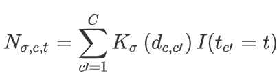
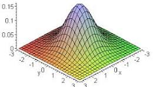
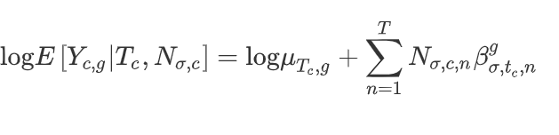
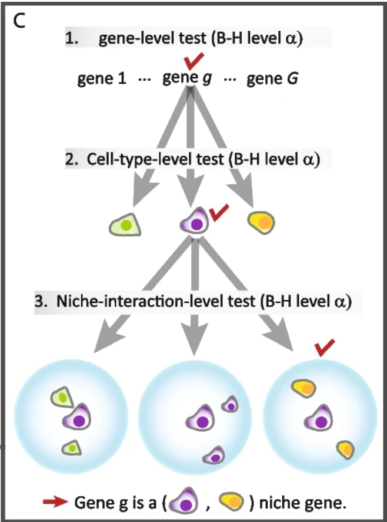

# Spatial Transcriptomics Part 4: Niche-Differential Gene Expression with the nicheDE R package


Niche-differential gene expression [(Mason et al., 2024)](https://genomebiology.biomedcentral.com/articles/10.1186/s13059-023-03159-6) identifies genes whose expression in a given cell type is influenced by the cell types in the local microenvironment. 

We use the [nicheDE](https://github.com/kaishumason/NicheDE/) R package accompanying the above article for our analysis.


## Read in cortex Seurat object with cell type annotations
We will use the cortex subset of the Xenium data used in the previous section of the course.

``` r
cortex <- readRDS("cortex.rds")
```

## Create expression profile matrix from reference data
The background average expression profile from each cell type is obtained from reference data.  We use the Allen Brain Atlas cortex data from the previous section.


``` r
allen <- readRDS("allen_cortex.rds")
Idents(allen) <- "subclass"
L <- CreateLibraryMatrixFromSeurat(allen, assay = 'RNA')
```

```
## [1] "Computing average expression profile matrix"
## [1] "Too many cell of type Vip, downsampling to 1000."
## [1] "Too many cell of type Lamp5, downsampling to 1000."
## [1] "Too many cell of type Sst, downsampling to 1000."
## [1] "Too many cell of type Pvalb, downsampling to 1000."
## [1] "Too many cell of type L6 IT, downsampling to 1000."
## [1] "Too many cell of type L4, downsampling to 1000."
## [1] "Average expression profile matrix computed."
```
NicheDE requires that the cell types in the analysis data _exactly_ match that in the reference data. For this reason, it easiest, if possible, to use the same reference data to obtain the average expression profile that was used for cell type identification.

The library matrix has a cell type not present in our data (CR), which we will manually remove:

``` r
drop <- which(rownames(L) == "CR")
L <- L[-drop,]
```

Change "L2/3 IT" celltype in library matrix to "L2-3 IT" to match our data

``` r
rownames(L) <- gsub("L2/3 IT", "L2-3 IT", rownames(L), fixed = TRUE)
```

## Set up deconvolution matrix from identified cell types
The deconvolution matrix tells NicheDE what type each cell has been assigned (or, for spot-level data, what mixture of cell types each spot has been predicted to contain).

Our deconvolution matrix will have a column for each cell type and a row for each cell.  A cell will have a 1 in the column that matches its predicted celltype and a 0 otherwise.

``` r
deconv_est <- model.matrix(~0 + cortex$predicted.celltype)
rownames(deconv_est) <- colnames(cortex)
colnames(deconv_est) <- gsub("cortex$predicted.celltype", "", colnames(deconv_est), fixed = TRUE)

# Force column order to be the same as rows of L
deconv_est <- deconv_est[, rownames(L)]
```

## Create NicheDE object

``` r
cortex.counts <- LayerData(cortex, layer = "counts")
counts_mat <- t(cortex.counts)
cortex.coords <- GetTissueCoordinates(cortex, which = "centroids")
rownames(cortex.coords) <- cortex.coords$cell
cortex.coords <- cortex.coords[,1:2] # take out "cell" column
NDE_obj <- CreateNicheDEObject(counts_mat = counts_mat, coordinate_mat = cortex.coords, library_mat = L, deconv_mat = deconv_est, sigma = c(100, 250, 500))
```

```
## [1] "Creating Niche-DE object"
## [1] "Niche-DE object created with 9879 observations, 340 genes, 1 batch(es), and 22 cell types."
```
Sigma is the standard deviation of the Gaussian kernel used in niche calculation (details below).

For Visium data, `sigma = c(1, 100, 250)` may be more appropriate.

## Calculate effective Niche
Identify neighboring cells that are in the immediate environment of each cell, based on cell coordinates and kernel bandwidth.


``` r
NDE_obj <- CalculateEffectiveNiche(NDE_obj)
```

```
## [1] "Calculating effective niche for kernel bandwith 100(1 out of 3 values)."
## [1] "Calculating effective niche for kernel bandwith 250(2 out of 3 values)."
## [1] "Calculating effective niche for kernel bandwith 500(3 out of 3 values)."
## [1] "Effective niche calculated"
```
## Run NicheDE


Arguments:

* num_cores: The number of cores to use when performing parallelization

* outfile: The file path to the txt on which workers will write status reports on

* C: The minimum total expression of a gene across observations needed for the niche-DE model to run. The default value is 150.

* M: Minimum number of spots containing the index cell type with the niche cell type in its effective niche for (index,niche) niche patterns to be investigated. The default value is 10

* Gamma: Percentile a gene needs to be with respect to expression in the index cell type in order for the model to investigate niche patterns for that gene in the index cell. The default value is 0.8 (80th percentile)

* Int: Logical for if data is count data. If True, a negative binomial regression is performed. Otherwise linear regression with a gene specific variance is applied. Default is True.

* self_EN: Logical if niche interactions between the same cell types should be considered. Default is False.

* G: Number of gigabytes each core should hold. If the counts matrix is bigger than G gigabytes, it is split into multiple chunks such that the size of each chunk is less than G gigabytes.

## Examine DE genes


``` r
DE_genes <- get_niche_DE_genes(NDE_obj, 'I', index = 'Oligo', niche = 'Astro', positive = T, alpha = 0.05)
```

```
## [1] "Returning Niche-DE Genes"
```

``` r
head(DE_genes)
```

```
##     Genes Pvalues.Interaction
## 2   Cryab        4.462312e-07
## 4     Id2        7.305770e-04
## 3     Gsn        1.490888e-03
## 7 Plekhb1        2.544947e-03
## 8  Syngr1        2.758693e-03
## 5     Mbp        3.547963e-03
```

The genes above have significantly higher expression in oligodendrocytes that are near astrocytes, compared to average oligodendrocyte expression.

We can use lapply to repeat this analysis over all pairs of index and niche cells.


``` r
head(NicheDE.results, 30)
```

```
##     Index Niche   Genes Pvalues.Interaction
## 1   Astro  Endo    Cd63        1.840866e-02
## 2   Astro  Endo   Tppp3        3.864281e-02
## 16  Astro    L4    Rorb        2.183863e-10
## 3   Astro    L4    Cd63        3.607709e-06
## 10  Astro    L4   Mertk        7.801465e-06
## 11  Astro    L4   Ntsr2        1.694301e-04
## 4   Astro    L4   Cdh20        2.110896e-04
## 13  Astro    L4 Plekhb1        2.394844e-04
## 5   Astro    L4    Clmn        9.446550e-04
## 15  Astro    L4   Prdx6        1.459752e-03
## 6   Astro    L4    Ctsb        1.590515e-03
## 25  Astro    L4 Bhlhe40        2.255197e-03
## 17  Astro    L4    Tle4        4.223759e-03
## 14  Astro    L4 Ppp1r1b        6.137328e-03
## 8   Astro    L4     Gns        7.102540e-03
## 7   Astro    L4    Dner        2.213793e-02
## 12  Astro    L4   Pde7b        3.669347e-02
## 110 Astro    L4  Acsbg1        3.984212e-02
## 9   Astro    L4     Id2        4.322719e-02
## 111 Astro L5 IT    Cd63        5.425245e-04
## 51  Astro L5 IT    Dkk3        7.565075e-04
## 61  Astro L5 IT   Mertk        2.675376e-03
## 71  Astro L5 IT   Ntsr2        3.495031e-03
## 81  Astro L5 IT Plekhb1        3.515800e-03
## 91  Astro L5 IT   Prdx6        6.179895e-03
## 112 Astro L5 IT    Tle4        8.571327e-03
## 101 Astro L5 IT  Syngr1        9.102447e-03
## 41  Astro L5 IT     Clu        1.423734e-02
## 121 Astro L5 IT   Tppp3        1.484999e-02
## 31  Astro L5 IT    Clmn        1.849889e-02
```

## The math behind NicheDE

First, for each cell, NicheDE defines the cell neighborhood using the distances to all other cells and a Gaussian kernel K:



If we defined K as 1 if d < max.dist and 0 otherwise, the neighborhood would just be the number of cells of the given type within max.dist of our index cell.

The Gaussian kernel instead allows cells closer to the index cell to have a greater influence than cells farther away. 

<!-- -->

The standard deviation of the kernel (the bandwidth) sigma determines the distance over which neighboring cells are assumed to most influence the index cell. 

Once the neighborhoods have been defined, the niche DE model is then fitted:



In brief, the log mean expression of a gene g of celltype T is equal to the log mean background expression for that celltype plus a sum of contributions from neighboring cell types.

The betas are unknown parameters which are estimated and tested using a negative binomial model. A nonzero beta means a gene is niche-differentially expressed for a given index celltype and niche celltype combination.

## P-value adjustment
NicheDE adjusts p-values for multiple testing using a hierarchical approach:



###### From figure 1 of [https://genomebiology.biomedcentral.com/articles/10.1186/s13059-023-03159-6](https://genomebiology.biomedcentral.com/articles/10.1186/s13059-023-03159-6)

1. Test if a gene is nicheDE for any index-niche pair

2. Correct for multiple testing across genes using the [Benjamini-Hochberg](https://www.jstor.org/stable/2346101?seq=1) false discovery rate controlling approach (BH).

3. For significant genes, test if they are nicheDE for any index cell type.

4. Apply BH correction across cell types within each gene from (3).

5. For gene-index celltype combinations that are significant after steps 3 and 4, test if the gene is nicheDE for each niche celltype.

6. Apply BH correction across niche celltypes within each gene-index celltype combination.


## Choice of kernel bandwidth sigma

Users are recommended to use multiple values of the kernel bandwith sigma.  P-values are then combined across the different bandwidths using a [Cauchy combination test](https://pmc.ncbi.nlm.nih.gov/articles/PMC7531765/).

By default, the coordinates are transformed such that 100 is the median distance between units of observation (i.e. cells or spots). 

Per the package developer:

>For spot data which can contain many cells like Visium, we recommend using a sigma vector that contains a small value (e.g. 1), a value equal to the distance between neighboring spots (100), and a value somewhat larger, say 2-3 times the distance between neighboring spots (200-300).

>For Xenium, it may make sense to increase sigma to be such that on average 5-10 cells are within a distance sigma from a cell.

#### Download Rmd
# ADD FILE DOWNLOAD HERE

#### Session information

``` r
sessionInfo()
```

```
## R version 4.4.3 (2025-02-28 ucrt)
## Platform: x86_64-w64-mingw32/x64
## Running under: Windows 11 x64 (build 22631)
## 
## Matrix products: default
## 
## 
## locale:
## [1] LC_COLLATE=English_United States.utf8 
## [2] LC_CTYPE=English_United States.utf8   
## [3] LC_MONETARY=English_United States.utf8
## [4] LC_NUMERIC=C                          
## [5] LC_TIME=English_United States.utf8    
## 
## time zone: America/Los_Angeles
## tzcode source: internal
## 
## attached base packages:
## [1] stats     graphics  grDevices datasets  utils     methods   base     
## 
## other attached packages:
## [1] dplyr_1.1.4        nicheDE_0.0.0.9000 Seurat_5.2.1       SeuratObject_5.0.2
## [5] sp_2.2-0          
## 
## loaded via a namespace (and not attached):
##   [1] poolr_1.1-1            deldir_2.0-4           pbapply_1.7-2         
##   [4] gridExtra_2.3          rlang_1.1.5            magrittr_2.0.3        
##   [7] RcppAnnoy_0.0.22       spatstat.geom_3.3-6    matrixStats_1.5.0     
##  [10] ggridges_0.5.6         compiler_4.4.3         png_0.1-8             
##  [13] vctrs_0.6.5            reshape2_1.4.4         stringr_1.5.1         
##  [16] pkgconfig_2.0.3        fastmap_1.2.0          promises_1.3.2        
##  [19] rmarkdown_2.29         purrr_1.0.4            xfun_0.51             
##  [22] cachem_1.1.0           jsonlite_1.9.1         goftest_1.2-3         
##  [25] later_1.4.1            spatstat.utils_3.1-3   irlba_2.3.5.1         
##  [28] parallel_4.4.3         cluster_2.1.8          R6_2.6.1              
##  [31] ica_1.0-3              spatstat.data_3.1-6    bslib_0.9.0           
##  [34] stringi_1.8.4          RColorBrewer_1.1-3     reticulate_1.41.0.1   
##  [37] spatstat.univar_3.1-2  parallelly_1.42.0      lmtest_0.9-40         
##  [40] jquerylib_0.1.4        scattermore_1.2        iterators_1.0.14      
##  [43] Rcpp_1.0.14            knitr_1.50             tensor_1.5            
##  [46] future.apply_1.11.3    zoo_1.8-13             sctransform_0.4.1     
##  [49] httpuv_1.6.15          Matrix_1.7-2           splines_4.4.3         
##  [52] igraph_2.1.4           tidyselect_1.2.1       abind_1.4-8           
##  [55] rstudioapi_0.17.1      yaml_2.3.10            doParallel_1.0.17     
##  [58] spatstat.random_3.3-3  codetools_0.2-20       miniUI_0.1.1.1        
##  [61] spatstat.explore_3.4-2 listenv_0.9.1          lattice_0.22-6        
##  [64] tibble_3.2.1           plyr_1.8.9             withr_3.0.2           
##  [67] shiny_1.10.0           ROCR_1.0-11            evaluate_1.0.3        
##  [70] Rtsne_0.17             future_1.34.0          fastDummies_1.7.5     
##  [73] survival_3.8-3         polyclip_1.10-7        fitdistrplus_1.2-2    
##  [76] pillar_1.10.1          KernSmooth_2.23-26     foreach_1.5.2         
##  [79] renv_1.1.4             plotly_4.10.4          generics_0.1.3        
##  [82] mathjaxr_1.6-0         RcppHNSW_0.6.0         ggplot2_3.5.1         
##  [85] munsell_0.5.1          scales_1.3.0           globals_0.16.3        
##  [88] xtable_1.8-4           glue_1.8.0             lazyeval_0.2.2        
##  [91] tools_4.4.3            data.table_1.17.0      RSpectra_0.16-2       
##  [94] RANN_2.6.2             dotCall64_1.2          cowplot_1.1.3         
##  [97] grid_4.4.3             tidyr_1.3.1            colorspace_2.1-1      
## [100] nlme_3.1-167           patchwork_1.3.0        cli_3.6.4             
## [103] spatstat.sparse_3.1-0  spam_2.11-1            viridisLite_0.4.2     
## [106] uwot_0.2.3             gtable_0.3.6           sass_0.4.9            
## [109] digest_0.6.37          progressr_0.15.1       ggrepel_0.9.6         
## [112] htmlwidgets_1.6.4      farver_2.1.2           htmltools_0.5.8.1     
## [115] lifecycle_1.0.4        httr_1.4.7             mime_0.13             
## [118] MASS_7.3-64
```
