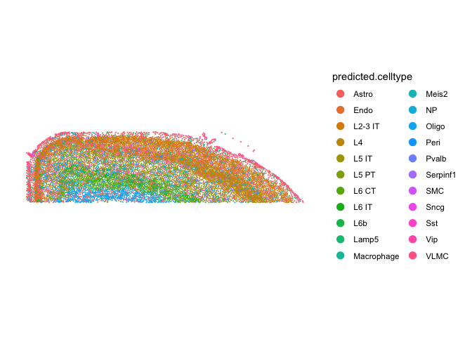
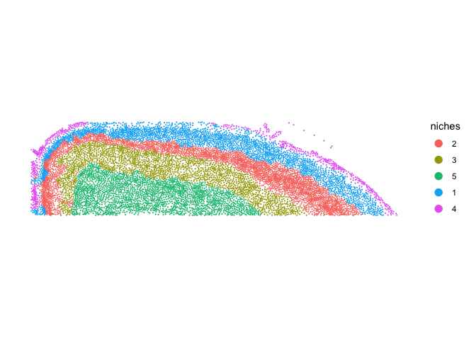
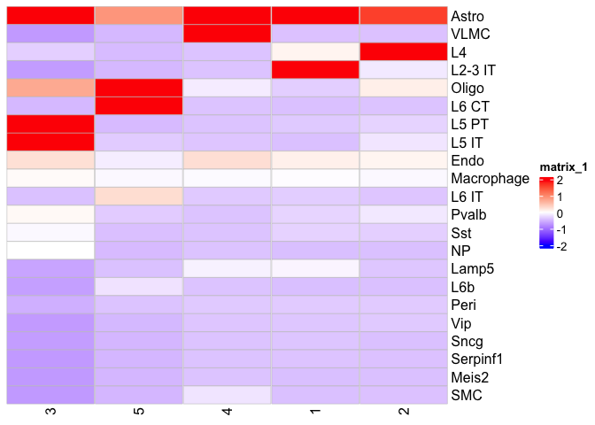

# Spatial Transcriptomics Part 4: Simply Niche analysis


## Set up the workspace


``` r
library(Seurat)     # Spatial transcriptomics analysis
library(kableExtra) # format tables
library(ggplot2)   # create graphics
library(viridis)   # accessible color palettes
library(ComplexHeatmap)  # visualization heatmaps
```

We are going to use the cortex region that was subsetted previously for this exercise.


``` r
cortex <- readRDS("cortex.rds")
```

## Find niches

Up until now, we have done analyses that are very similar to regular single cell RNASeq data analysis, without utilizing the spatial information of the cell except for in visualizations. One of the popular analyses for spatial transcriptomics is to identify niches. A nich are regions of tissue, each of which is defined by a different composition of spatially adjacent cell types. In Seurat, a local neighborhood for each cell is constructed by including its _neighbors.k_ spatially closest neighbors, and count the occurences of each cell type present in this neighborhood. Then a k-means clustering is done to group cells that have similar neighborhoods together, which is defined as spatial niches.

We will use _BuildNicheAssay_ function to perform this analysis.

There are over 300 cell types identified using the subclass level. I am going to use the clusters at the resolution 0.3 as an example to find niches.


``` r
cortex <- BuildNicheAssay(cortex, fov = "fov.TgCRND8", group.by = "predicted.celltype", niches.k = 5, neighbors.k = 30)
```

Let's visualize the niche result together with the cell types.


``` r
ImageDimPlot(cortex, fov = "fov.TgCRND8", group.by = "predicted.celltype", size = 0.75, dark.background = F)
```

<!-- -->

``` r
ImageDimPlot(cortex, fov = "fov.TgCRND8", group.by = "niches", size = 0.75, dark.background = F)
```

<!-- -->

Next, we can tally the number of each cell type within a niche.


``` r
mat <- table(cortex$predicted.celltype, cortex$niches)
mat
```

```
##             
##                 1    2    3    4    5
##   Astro       647  629  331  205  286
##   Endo        138  154  117   46   76
##   L2-3 IT    1033   84    3    0    3
##   L4          130 1369   47    0    7
##   L5 IT         3   78  349    1   30
##   L5 PT        17   39  403    0    6
##   L6 CT         3    6   27    0  718
##   L6 IT        24   12   35    3  159
##   L6b           0    1    6    0   63
##   Lamp5        91   13   10   21   16
##   Macrophage  102  115   90   25   92
##   Meis2         0    0    0    0    1
##   NP            0    1   85    0    6
##   Oligo        27  172  174   19  677
##   Peri         21   21   20    3   18
##   Pvalb        38   81   92    0   31
##   Serpinf1      8    2    1    0    1
##   SMC           4    3    0   15    0
##   Sncg         11    1    4    0    1
##   Sst          34   33   80    0   14
##   Vip          13   20    2    1    2
##   VLMC          6    4    1  265    3
```

Let's visualize this relationship


``` r
cell_fun = function(j, i, x, y, width, height, fill) {
                grid::grid.rect(x = x, y = y, width = width *0.99, 
                                height = height *0.99,
                                gp = grid::gpar(col = "grey", 
                                                fill = fill, lty = 1, lwd = 0.5))
}

col_fun=circlize::colorRamp2(c(-2, 0, 2), c("blue", "white", "red"))

Heatmap(scale(mat), show_row_dend = F, show_column_dend = F, rect_gp = grid::gpar(type = "none"), cell_fun = cell_fun, col = col_fun, column_names_rot = 90)
```

<!-- -->

Please play around with the number of niches that _BuildNicheAssay_ should find and see how the cell type distribution changes.

## Prepare for the next section


#### Download Rmd

``` r
download.file("https://raw.githubusercontent.com/ucdavis-bioinformatics-training/2025-March-Spatial-Transcriptomics/main/data_analysis/05-NicheDE.Rmd", "05-NicheDE.Rmd")
```

#### Session information

``` r
sessionInfo()
```

```
## R version 4.4.3 (2025-02-28)
## Platform: aarch64-apple-darwin20
## Running under: macOS Ventura 13.7.1
## 
## Matrix products: default
## BLAS:   /Library/Frameworks/R.framework/Versions/4.4-arm64/Resources/lib/libRblas.0.dylib 
## LAPACK: /Library/Frameworks/R.framework/Versions/4.4-arm64/Resources/lib/libRlapack.dylib;  LAPACK version 3.12.0
## 
## locale:
## [1] en_US.UTF-8/en_US.UTF-8/en_US.UTF-8/C/en_US.UTF-8/en_US.UTF-8
## 
## time zone: America/Los_Angeles
## tzcode source: internal
## 
## attached base packages:
## [1] grid      stats     graphics  grDevices utils     datasets  methods  
## [8] base     
## 
## other attached packages:
## [1] ComplexHeatmap_2.20.0 viridis_0.6.5         viridisLite_0.4.2    
## [4] ggplot2_3.5.1         kableExtra_1.4.0      Seurat_5.2.1         
## [7] SeuratObject_5.0.2    sp_2.1-4             
## 
## loaded via a namespace (and not attached):
##   [1] RColorBrewer_1.1-3     shape_1.4.6.1          rstudioapi_0.16.0     
##   [4] jsonlite_1.8.8         magrittr_2.0.3         magick_2.8.5          
##   [7] spatstat.utils_3.1-2   farver_2.1.2           rmarkdown_2.27        
##  [10] GlobalOptions_0.1.2    vctrs_0.6.5            ROCR_1.0-11           
##  [13] Cairo_1.6-2            spatstat.explore_3.2-7 htmltools_0.5.8.1     
##  [16] sass_0.4.9             sctransform_0.4.1      parallelly_1.37.1     
##  [19] KernSmooth_2.23-26     bslib_0.7.0            htmlwidgets_1.6.4     
##  [22] ica_1.0-3              plyr_1.8.9             plotly_4.10.4         
##  [25] zoo_1.8-12             cachem_1.1.0           igraph_2.0.3          
##  [28] mime_0.12              lifecycle_1.0.4        iterators_1.0.14      
##  [31] pkgconfig_2.0.3        Matrix_1.7-2           R6_2.5.1              
##  [34] fastmap_1.2.0          clue_0.3-65            fitdistrplus_1.1-11   
##  [37] future_1.33.2          shiny_1.8.1.1          digest_0.6.35         
##  [40] colorspace_2.1-0       S4Vectors_0.44.0       patchwork_1.2.0       
##  [43] tensor_1.5             RSpectra_0.16-1        irlba_2.3.5.1         
##  [46] labeling_0.4.3         progressr_0.14.0       fansi_1.0.6           
##  [49] spatstat.sparse_3.0-3  httr_1.4.7             polyclip_1.10-6       
##  [52] abind_1.4-5            compiler_4.4.3         withr_3.0.0           
##  [55] doParallel_1.0.17      fastDummies_1.7.3      highr_0.11            
##  [58] MASS_7.3-64            rjson_0.2.21           tools_4.4.3           
##  [61] lmtest_0.9-40          httpuv_1.6.15          future.apply_1.11.2   
##  [64] goftest_1.2-3          glue_1.7.0             nlme_3.1-167          
##  [67] promises_1.3.0         Rtsne_0.17             cluster_2.1.8         
##  [70] reshape2_1.4.4         generics_0.1.3         gtable_0.3.5          
##  [73] spatstat.data_3.0-4    tidyr_1.3.1            data.table_1.15.4     
##  [76] xml2_1.3.6             utf8_1.2.4             BiocGenerics_0.50.0   
##  [79] spatstat.geom_3.2-9    RcppAnnoy_0.0.22       ggrepel_0.9.5         
##  [82] RANN_2.6.1             foreach_1.5.2          pillar_1.9.0          
##  [85] stringr_1.5.1          spam_2.10-0            RcppHNSW_0.6.0        
##  [88] later_1.3.2            circlize_0.4.16        splines_4.4.3         
##  [91] dplyr_1.1.4            lattice_0.22-6         survival_3.8-3        
##  [94] deldir_2.0-4           tidyselect_1.2.1       miniUI_0.1.1.1        
##  [97] pbapply_1.7-2          knitr_1.47             gridExtra_2.3         
## [100] IRanges_2.38.0         svglite_2.1.3          scattermore_1.2       
## [103] stats4_4.4.3           xfun_0.44              matrixStats_1.3.0     
## [106] stringi_1.8.4          lazyeval_0.2.2         yaml_2.3.8            
## [109] evaluate_0.23          codetools_0.2-20       tibble_3.2.1          
## [112] cli_3.6.2              uwot_0.2.2             xtable_1.8-4          
## [115] reticulate_1.39.0      systemfonts_1.1.0      munsell_0.5.1         
## [118] jquerylib_0.1.4        Rcpp_1.0.12            globals_0.16.3        
## [121] spatstat.random_3.2-3  png_0.1-8              parallel_4.4.3        
## [124] dotCall64_1.1-1        listenv_0.9.1          scales_1.3.0          
## [127] ggridges_0.5.6         purrr_1.0.2            crayon_1.5.2          
## [130] GetoptLong_1.0.5       rlang_1.1.3            cowplot_1.1.3
```
