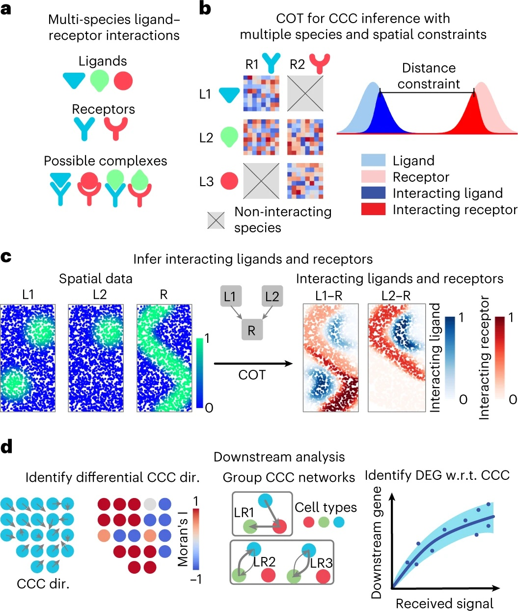
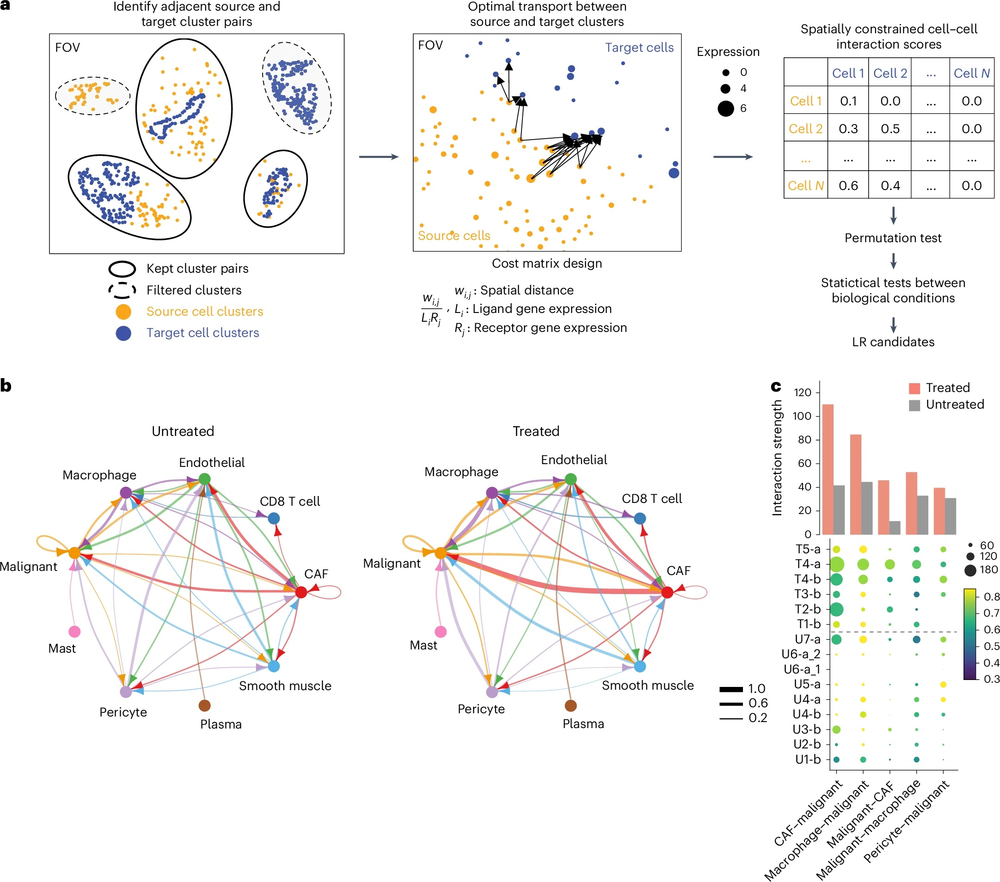

# Spatial Transcriptomics Part 4: Cell Cell Communications analysis

There have been many methods developed for Cell Cell Communications for single cell RNASeq data that rely on the expression levels of ligand and receptor pairs and explicitly defined functions. Some examples of these methods: [CellPhoneDB](https://www.nature.com/articles/s41596-024-01137-1), [ICELLNET](https://www.nature.com/articles/s41467-021-21244-x), [CellChat](https://www.nature.com/articles/s41467-021-21246-9) that utilize the information in multi-subunit composition of protein complexes; [SoptSC](https://pubmed.ncbi.nlm.nih.gov/30923815/), [NicheNet](https://pubmed.ncbi.nlm.nih.gov/31819264/), and [CytoTalk](https://pubmed.ncbi.nlm.nih.gov/33853780/) ues downstream intracellular gene-gene interactions; and [scTensor](https://bmcbioinformatics.biomedcentral.com/articles/10.1186/s12859-023-05490-y) considers higher order interactions beyond 1-to-1 cell interactions. Although these methods have enabled many studies detecting potential cell cell communications, the one biggest caveat is the lack of spatial context that produces false positives. Within the past a year and half, at least 3 methods have been developed for specifically spatial transcriptomics data. [COMMOT](https://www.nature.com/articles/s41592-022-01728-4), [SCOTIA](https://www.nature.com/articles/s41588-024-01890-9), and [DeepTalk](https://www.nature.com/articles/s41467-024-51329-2). Both COMMOT and SCOTIA leverage optimal transport model that accounts for both spatial distance and ligand-receptor gene expressions.

Here is the summary figure for COMMOT.

  

Here is a figure from the publication of SCOTIA to demonstrate what type of analysis it offers.

  

We are going to do some exercise using SCOTIA.

