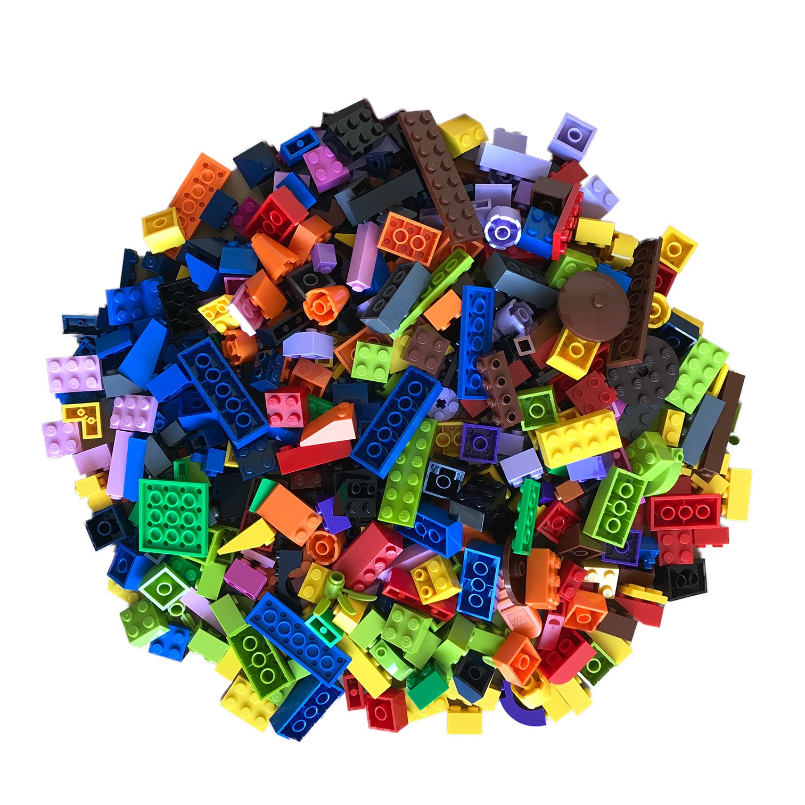
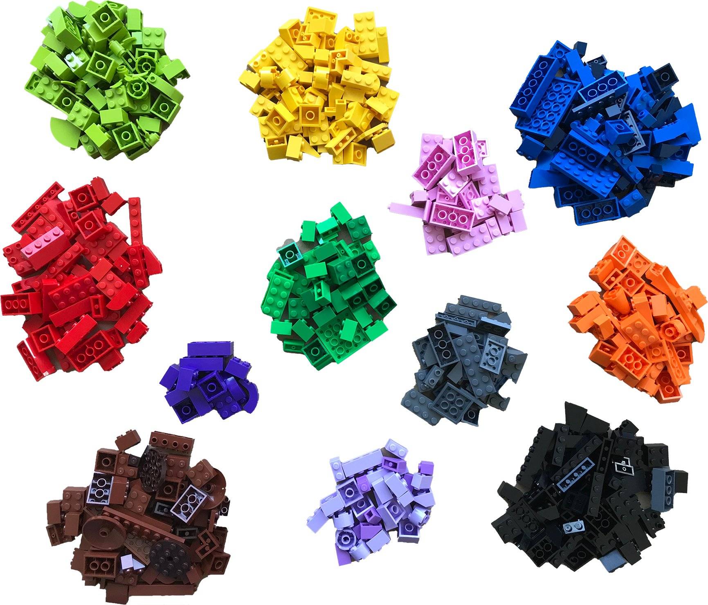
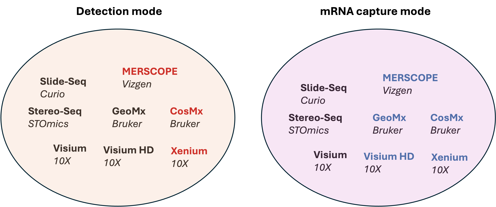
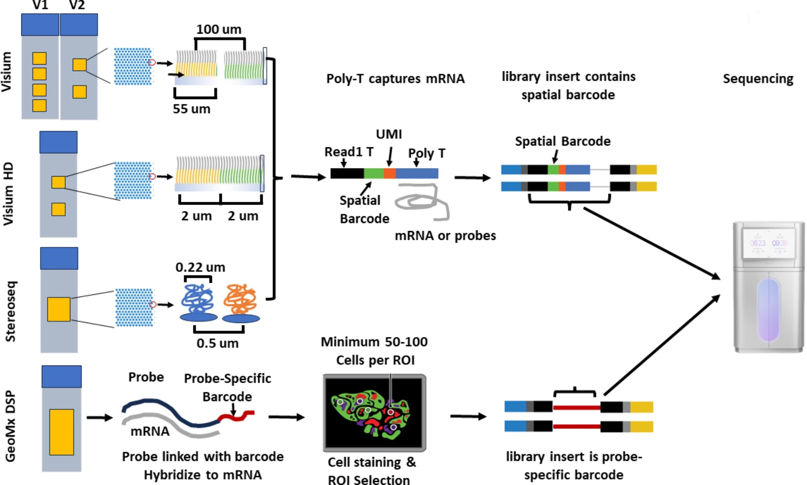
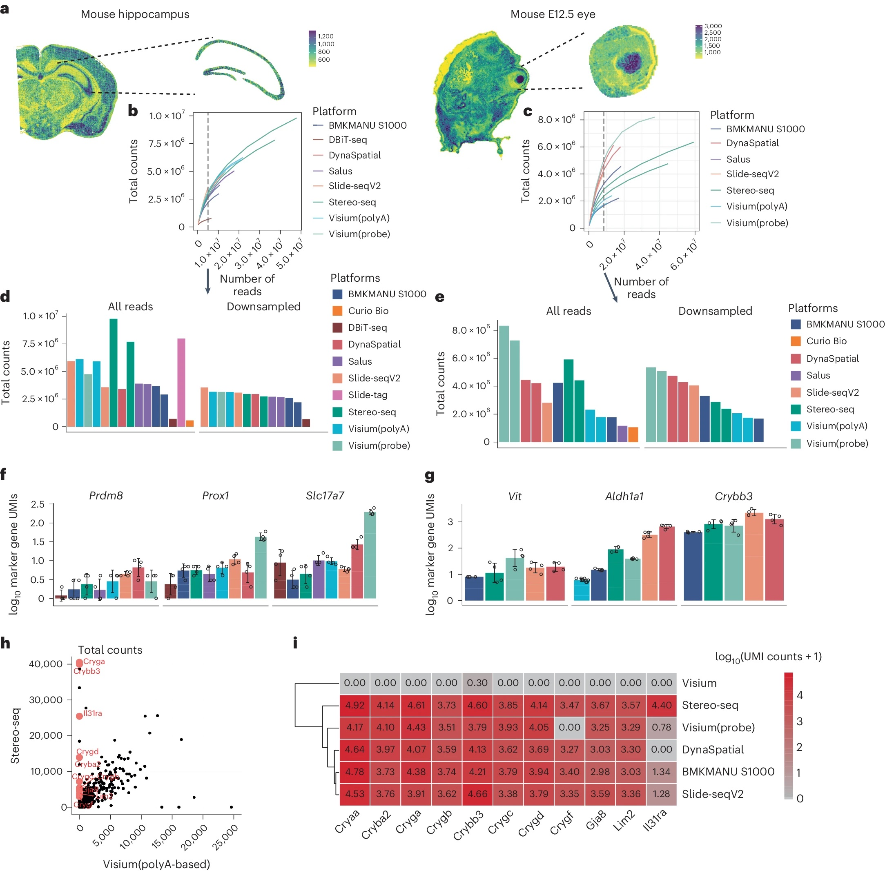
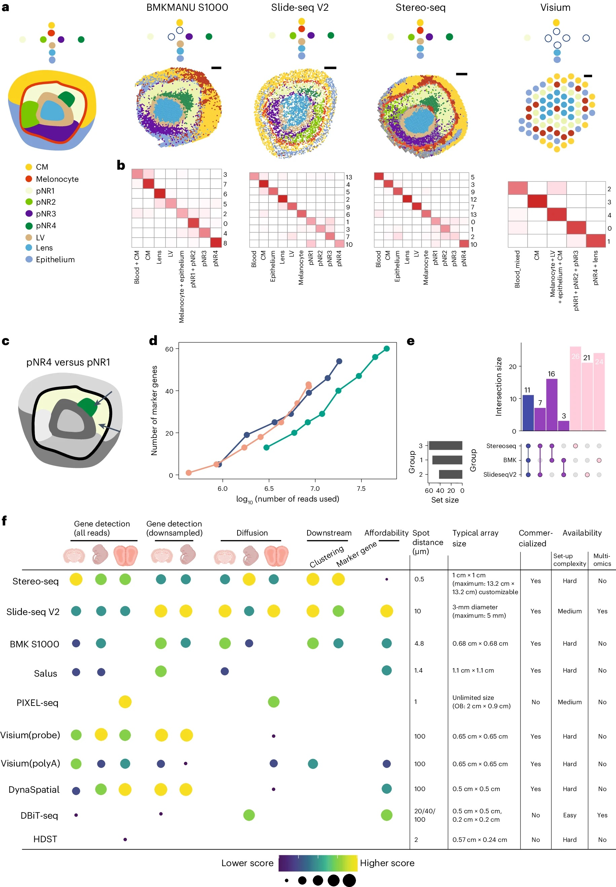
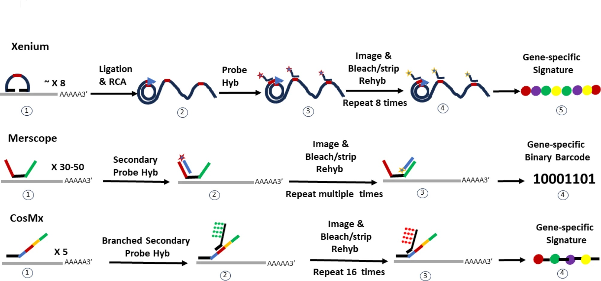
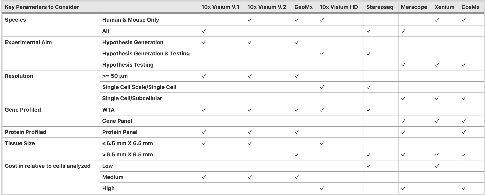

# Why Spatial Transcriptomics

  
&nbsp; &nbsp; &nbsp; &nbsp; &nbsp; &nbsp;
  
&nbsp; &nbsp; &nbsp; &nbsp; &nbsp; &nbsp;
  

# Spatial Transcriptomics Platforms

  

## Sequencing based

  

Lim, H.J., Wang, Y., Buzdin, A. et al. https://doi.org/10.1186/s12864-025-11235-3

___10X Genomics Visium___ application permeabilize the fresh frozon tissue to release mRNA from the cells, which then binds to the spatially barcoded poly(dT) oligonucleotides preent on the spots. For FFPE samples, the mRNAs released from the cells are captured using probes. The spatially barcoded molecules are then pooled for downstream processing to generate a sequencing library. Each slide has 2 or 4 capture areas. The size of the capture areas is 6.5 by 6.5 mm for V1 and V2, with an additional 11 by 11 mm setting for V2. The barcoded spots have a dimension of 55 microns and a distance of 100 microns between spots. The resolution of this platform is between 1 to 10 cells per spot.

___10X Genomics Visium HD___ slides contain two 6.5 X 6.5 mm capture areas with a continuous array of oligonucleotides in millions of 2 by 2 microns barcoded squares without gaps. This application achieves single-cell level spatial resolution. The tissue is imaged with H&E staining, followed by probe hybridization that targets 18085 genes for human and 19059 genes for mouse using ~54-55K probes. The hybridized probes are transferred onto the Visium HD slide in the CytAssist instrument for sequencing library preparation.

___Slide-Seq___ transfers RNA from tissue sections onto a surface that is covered in DNA-barcoded beads with known physical locations, which allows for the position of RNAs at a 10 micro resolution. The mRNAs are caputured by polydT oligonucleotides, that allows spatial profiling of non-model organisms.

___StereoSeq___ uses multidomain probes that include poly(dT) sequence to capture RNAs in a fresh tissue, as well as random barcoded sequences, coordinate identity, and molecular identifiers. It generates circularized sequences for rolling circle amplification and sequence on DNBSeq platforms. The spot size is 200nm and the distance between spots is 500nm. It provides large capture area of 1 cm^2 for standard frame and can be expanded to 13 X 13 cm^2.

___GeoMx DSP___ hybridizes a pool of gene-specific probes to mRNAs. Each probe is linked to a unique digital spatial profiling (DSP) barcode via a UV-cleavable linker. After hybridization and optionally the selection of regions of interest, UV light is used to cleave the DSP barcodes that will undergo library preparation and sequencing. This platform is capable of profiling the whole transcriptomes and/or 570+ proteins at a resolution of at least 10 microns.

A recent study compares a few sequencing based spatial transcriptomic platforms.

  

You, Y., Fu, Y., Li, L. et al. Nat Methods 21, 1743–1754 (2024). https://doi.org/10.1038/s41592-024-02325-3

  

You, Y., Fu, Y., Li, L. et al. Nat Methods 21, 1743–1754 (2024). https://doi.org/10.1038/s41592-024-02325-3

## Image based

  

Lim, H.J., Wang, Y., Buzdin, A. et al. BMC Genomics 26, 47 (2025). https://doi.org/10.1186/s12864-025-11235-3

___Xenium___ provides a large analyzable area of up to 472 mm^2 per run with 2 slides, where a unique dual hybridization and ligation probe chemistry allows for specific and sensitive binding without off-target issues. The platform offers pre-built gene panels that range from ~248 genes to ~5K genes targeting human and mouse tissues. Customers have the opportunity to add up to 100 genes to each panel, or build custome panel with up to 480 genes. The resolution is at ~200nm per pixel. Xenium prime offers a 5K gene panel for detection for human and mouse.

___Merscope___ uses a binary barcode strategy for gene identification, where each gene is assigned a unique binary barcode. The probe hybridization uses 30 to 50 gene-specific primary probes hybridize to different regions of the target gene. Each primary probe has a target-binding domain for RNA hybridization and "hangout tails" for secondary probe binding. The secondary probes are fluorescently labeled or unlabeled and bind to the tails of the primary probes. The imaging area is large with 1.0 cm^2 per slide for MERSCOPE and up to 3 cm^2 for MERSCOPE ULTRA. The resolution is high at 100nm per pixel. It has a multiplex capacity of up to 1K genes.

___CosMx___ uses probes that are composed of two regions. The first region is 35 to 50 nucleotides in length and has gene specific sequences to bind to target mRNAs. The second readout region has 4 domains that bind to reporter probes that are fluorophore labeled. The number of cycles used in reporter probe binding leads to different multiplex capacities. It has a 6K gene panel for human and is developing a whole transcriptome panel for human that will be released this year. CosMx offers a 300 mm^2 imaging area.

Overall, the metrics to consider when selecting the optimal technology.

  

Lim, H.J., Wang, Y., Buzdin, A. et al. BMC Genomics 26, 47 (2025). https://doi.org/10.1186/s12864-025-11235-3

---

